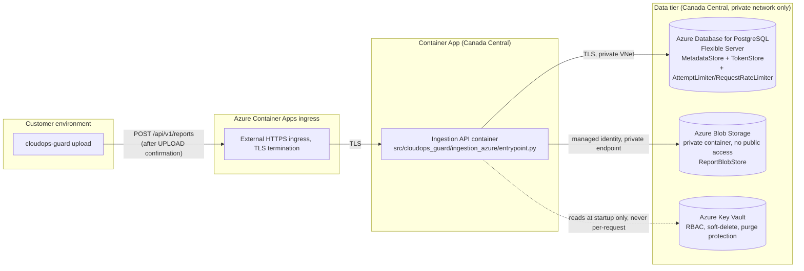

# CloudOps Guard ingestion API — Azure production deployment (Phase 4G-A)

**This document describes deployable code and infrastructure-as-code
Phase 4G-A has produced. It authorizes nothing.** No Azure resource has
been created. No credential has been read from a real Azure account. No
image has been pushed to any registry. Phase 4G-B — separately
authorized — is the only phase that may run any of the commands this
document describes against a real subscription.

## 0. Recorded human decisions (implemented, not made, by this phase)

Per the Phase 4G-A task's own "Recorded human decisions" section:

| Decision | Value |
|---|---|
| Cloud provider | Microsoft Azure |
| Region / data residency | Canada Central (`canadacentral`) — every data-bearing resource in `infra/azure/` is hard-coded to this region |
| Architecture | Managed-container "Option A", `docs/deployment/ingestion-production.md` §3 |
| Runtime | Azure Container Apps, Consumption plan |
| Container registry | Azure Container Registry, Basic SKU |
| Database | Azure Database for PostgreSQL Flexible Server |
| Blob storage | Azure Blob Storage |
| Distributed limiter | PostgreSQL-backed (no Azure Managed Redis / Azure Cache for Redis in this pilot baseline) |
| Approved pilot budget ceiling | CAD $100/month before tax — **an alerting ceiling, not a hard spending cap** (§5 below). **Left unchanged pending a human re-decision — see below.** |
| Target ordinary pilot spend | **Unresolved — correction pass, item 6.** The originally-recorded ~CAD $42–70/month figure was superseded by a corrected recalculation (§5) that includes costs the original estimate omitted (the Key Vault private endpoint, custom-VNet Container Apps managed networking); the corrected range is ~CAD $58–124/month, whose upper bound **exceeds** the CAD $100 ceiling above. This is a genuine, unresolved conflict between the recorded budget ceiling and the recorded architecture, not a Phase 4G-A implementation defect — see §5's own explicit escalation and the authorization checklist's cost/budget precondition, now unchecked pending one of the two human decisions §5 names. |
| Live-report retention | 90 days (unchanged from `docs/milestones/v0.4.0-ingestion-api.md` §C's proposed default) |
| Physical-purge SLA | within 30 days after retirement (unchanged) |
| Backup rotation | initial target seven days (`infra/azure/modules/postgresql.bicep`) |
| Pilot recovery objectives | RPO 24 hours, RTO 8 hours (§7) |
| Excluded from this pilot baseline | AKS, any Kubernetes cluster, standalone VMs, NAT Gateway, Front Door, WAF, dedicated Redis, geo-replication, cross-region failover — enforced structurally, not just by omission (`tests/ingestion_azure/test_bicep_infrastructure.py::TestReplicaConstraint::test_container_app_forbidden_resource_types_are_absent`) |

These decisions authorize **Phase 4G-A implementation only**. They do
not authorize creating an Azure resource, logging into Azure, configuring
a GitHub Environment, creating credentials, issuing a token, dispatching
a workflow, deploying the API, or onboarding a customer — see §9's
Phase 4G-B checklist for what remains.

## 1. What Phase 4G-A implemented

- `src/cloudops_guard/ingestion_azure/` — real PostgreSQL `MetadataStore`/
  `TokenStore`/`AttemptLimiter`/`RequestRateLimiter` adapters, a real
  Azure Blob Storage `ReportBlobStore` adapter, versioned schema
  migrations, strict fail-closed production configuration loading, a
  production ASGI entrypoint, an Azure Container Apps trusted-proxy
  source-identifier resolver, and offline operator tooling
  (`ops_cli.py`: migrations, retention sweep, purge, limiter cleanup,
  tenant inventory, tenant offboarding).
- `Dockerfile` / `.dockerignore` — a hardened, non-root, digest-pinned,
  multi-stage production container image.
- `infra/azure/` — modular Bicep infrastructure-as-code, split into
  `foundation.bicep` (everything an image build doesn't need) and
  `app.bicep` (the Container App and Jobs, requiring a real image
  digest).
- `.github/workflows/deploy-ingestion-azure.yml` — a manual-dispatch-only
  deployment/rollback workflow, never triggered automatically.
- This document, plus updates to `CLAUDE.md`, the milestone document,
  `docs/deployment/ingestion-production.md`, `docs/pilots/
  ingestion-pilot-runbook.md`, and `docs/pilots/
  phase-4g-authorization-checklist.md` (§10).

**No production adapter, container, Bicep template, or workflow in this
phase creates an Azure resource, contacts a real Azure subscription, or
is invoked by anything else in this codebase.** Every adapter is tested
against a local, offline stand-in only (a real PostgreSQL container; a
real, local Azurite Azure Storage emulator) — see §8.

## 2. Architecture

Identical to `docs/deployment/ingestion-production.md` §4's diagram, now
with a concrete provider:



**Trust boundaries**: unchanged from `docs/deployment/
ingestion-production.md` §5 — no trust boundary crosses into `web/`; this
deployment unit remains architecturally isolated from the existing
static-assets and contact-API Cloudflare units.

## 3. Dependency and architecture choices

- **`psycopg[binary,pool]`** — a maintained, synchronous PostgreSQL
  driver with a built-in connection pool. No ORM: the storage interfaces
  (`cloudops_guard.ingestion.interfaces`) are already a thin, explicit
  contract, and hand-written SQL keeps the exact atomicity/locking
  behavior those interfaces require directly auditable (see §4's schema
  section). Synchronous, because every adapter method is already invoked
  from `ingestion_api.app`'s existing `anyio.to_thread.run_sync`
  worker-thread offload — there is no event loop inside an adapter to
  justify an async driver.
- **`azure-storage-blob` / `azure-identity`** — the official Azure SDKs.
  `ReportBlobStore.put_if_absent`'s conditional-create requirement maps
  directly onto Blob Storage's own `If-None-Match: *` upload
  precondition; `DefaultAzureCredential` is the only way this codebase
  ever authenticates to Blob Storage — no storage-account key exists
  anywhere in this package, the container image, or Bicep template
  (`allowSharedKeyAccess: false` is set at the storage-account level
  too, `infra/azure/modules/storage.bicep`).
- **Per-tenant PostgreSQL advisory transaction locks**
  (`pg_advisory_xact_lock(hashtextextended(tenant_id, 0))`) for every
  `PostgresMetadataStore` mutation — a stricter, simpler, and *better-
  concurrency* analogue of `InMemoryMetadataStore`'s own single
  process-wide lock (which serializes every tenant against one lock;
  the Postgres adapter only serializes callers for the *same* tenant).
  Proven correct under real concurrent database transactions
  (`tests/ingestion_azure/test_postgres_metadata_store_concurrency.py`).

## 4. Schema and migration design

Five forward-only migrations (`src/cloudops_guard/ingestion_azure/
migrations/000{1..5}_*.sql`), applied by `migration_runner.py` (an
advisory-lock-serialized, checksum-drift-detecting, safe-to-run-more-
than-once runner — `ops_cli.py migrate`/`migration-status`):

1. `ingestion_records` (+ a partial unique index on `(tenant_id,
   report_fingerprint) WHERE status = 'received'` — the actual atomic-
   dedup enforcement mechanism, at the database level, not merely
   application logic), `idempotency_bindings`, `tombstones`,
   `purge_claims`, and the `ingestion_generation_seq`/
   `ingestion_claim_id_seq` sequences backing the exact `PurgeClaim`
   `(generation, claim_id)` identity `docs/milestones/
   v0.4.0-ingestion-api.md` §H's interface requires.
2. `tokens` — `lookup_id` primary key, Argon2id hash only.
3. `attempt_failures` — insert-only rows, one per recorded failure;
   `is_blocked` counts rows within a rolling window, so a failure
   automatically stops counting once it ages out (never a separate
   reset operation).
4. `request_rate_counters` — a fixed-window counter per
   `(scope_key_hash, window_start)`, incremented via one atomic
   `INSERT ... ON CONFLICT ... DO UPDATE ... WHERE ... RETURNING`
   statement (`postgres_request_rate_limiter.py`).
5. `operator_audit_events` — append-only audit trail for the operator-
   only tenant-inventory/offboarding mechanism (§6).

Every `scope_key_hash`/`limiter` column stores an HMAC-SHA256 of the real
scope key (never the raw source IP or `lookup_id` in plaintext) —
`scope_key_hashing.py`, keyed by `COG_LIMITER_HMAC_KEY` (Key Vault
secret, never logged).

**Privilege separation** (documented here since Bicep cannot express
native PostgreSQL role/GRANT statements): after `foundation.bicep`
provisions the PostgreSQL Flexible Server, an operator must, once, out
of band, connect as the server's own administrator and run the
statements below **in the exact order shown, before ever running
`migrate`**.

**Correction-pass item 6 (fixed ordering)**: an earlier version of this
checklist ran `GRANT ... ON ALL TABLES IN SCHEMA public` immediately
after role creation, before any migration had ever run. At that point
`schema public` contains zero tables, so PostgreSQL's `ON ALL TABLES`
grants exactly nothing — it is a one-time, present-tense operation, not
a standing rule, and the migration-created tables that come later (e.g.
`ingestion_records`) never inherited it. `cog_runtime`/`cog_operator`
would hold **zero** privileges on any real table. Fixed by using `ALTER
DEFAULT PRIVILEGES FOR ROLE cog_migrator` — set up *before* migrations
run — so every table/sequence `cog_migrator` subsequently creates
automatically carries the configured grant. Independently reproduced and
mutation-verified against a real local PostgreSQL database:
`tests/ingestion_azure/test_postgres_role_privilege_separation.py`.

```sql
-- Step 1: create every role.
CREATE ROLE cog_runtime WITH LOGIN PASSWORD '<generated, stored only in Key Vault>';
CREATE ROLE cog_migrator WITH LOGIN PASSWORD '<generated, stored only in Key Vault>';
CREATE ROLE cog_operator WITH LOGIN PASSWORD '<generated, stored only in Key Vault>';

-- Step 2: connect/usage grants, and full schema privilege for the
-- migrator only (needed for CREATE TABLE/ALTER/DROP -- never granted to
-- cog_runtime or cog_operator).
GRANT CONNECT ON DATABASE <db> TO cog_runtime, cog_migrator, cog_operator;
GRANT USAGE ON SCHEMA public TO cog_runtime, cog_migrator, cog_operator;
GRANT ALL ON SCHEMA public TO cog_migrator;

-- Step 3 (the fix): default privileges for objects the migrator role
-- will create, set up BEFORE `migrate` ever runs -- this is what makes
-- every table/sequence a future migration creates automatically grant
-- cog_runtime/cog_operator the DML access they need, with no further
-- manual step required after each future migration.
ALTER DEFAULT PRIVILEGES FOR ROLE cog_migrator IN SCHEMA public
  GRANT SELECT, INSERT, UPDATE, DELETE ON TABLES TO cog_runtime, cog_operator;
ALTER DEFAULT PRIVILEGES FOR ROLE cog_migrator IN SCHEMA public
  GRANT USAGE, SELECT ON SEQUENCES TO cog_runtime, cog_operator;

-- Step 4: only now run `migrate` (`ops_cli.py migrate`, authenticated as
-- cog_migrator) -- every table/sequence it creates from this point
-- onward automatically carries the Step 3 grants for cog_runtime/
-- cog_operator. Never reorder Step 4 before Step 3.
```

If migrations have *already* run once under the old, buggy ordering
(tables already exist with no grant), also run the original one-time
catch-up grant once, after `migrate`, to cover those already-existing
tables (Step 3's `ALTER DEFAULT PRIVILEGES` only affects objects created
*after* it is set — it is never retroactive):

```sql
GRANT SELECT, INSERT, UPDATE, DELETE ON ALL TABLES IN SCHEMA public TO cog_runtime, cog_operator;
GRANT USAGE, SELECT ON ALL SEQUENCES IN SCHEMA public TO cog_runtime, cog_operator;
```

This is a **Phase 4G-B provisioning step** — no automation in this
codebase runs these statements; they are recorded here so the step is
never forgotten, improvised, or misordered at deployment time.

## 5. Cost estimate (Canada Central, dated 2026-09-09)

**Correction-pass item 10 rebuild.** The prior version of this table
omitted two cost sources this same correction pass's own architecture
changes introduced: the Key Vault private endpoint (item 4) and the
managed public-IP/outbound-networking resources Azure provisions for a
custom-VNet Container Apps environment (item 4's workload-profiles
switch). Every unit price below marked **[live]** was queried directly
against Azure's public Retail Prices API
(`https://prices.azure.com/api/retail/prices`, `armRegionName eq
'canadacentral'` where regional, `armRegionName eq 'Global'` where the
meter is a flat worldwide rate) on 2026-09-09 — not recalled from
memory. Two line items marked **[standard]** (Private Link endpoints,
Standard Load Balancer) could not be re-queried live in this pass (the
public API's own rate limit was hit and did not reset within this
pass's time budget); their figures use Azure's long-published, stable
list prices for these SKUs, and **Phase 4G-B must re-verify all figures
below, live-queried figures included, before real spend begins** —
provider pricing changes over time and this remains a point-in-time
judgment, not a standing guarantee (mirroring `docs/deployment/
ingestion-production.md` §3's own caveat about managed-service-
availability claims).

| Component | SKU / meter | Unit price (CAD) | Assumed quantity | Estimated monthly cost (CAD) |
|---|---|---|---|---|
| Azure Container Apps | Consumption, 0.5 vCPU / 1 GiB, min 0 / max 2 replicas | qualitative (usage-based, no flat meter) | Low, bursty pilot traffic; mostly idle (scale-to-zero) | $5–15 |
| Azure Database for PostgreSQL Flexible Server | Burstable `Standard_B1ms`, 32 GiB storage | qualitative (compute + storage tiers) | Single instance, no HA, 7-day backup retention | $25–35 |
| Azure Blob Storage | StorageV2, Standard LRS | qualitative (capacity + transactions) | A few GB of report bytes at pilot scale | $1–3 |
| Azure Container Registry | Basic | $5/month flat | 1 registry | $5 (flat) |
| Azure Key Vault | Standard | qualitative (per-operation, low volume) | A handful of secrets, low operation count | <$1 |
| Log Analytics workspace | Pay-as-you-go, 30-day retention | qualitative (per-GB ingested) | Low log volume at pilot scale | $2–8 |
| Private endpoints (Blob + Key Vault) **[standard]** | Private Link endpoint | ~$0.01/hour + ~$0.01/GB processed | 2 endpoints × 730 hours + negligible pilot-scale data | $15–18 |
| Private DNS zones (`privatelink.blob.core.windows.net`, `privatelink.vaultcore.azure.net`) **[live]** | Azure DNS Private Zone $0.50/zone/month; Private Queries $0.40/1M | 2 zones + negligible pilot-scale query volume | 2 zones | $1–2 |
| Container Apps custom-VNet managed networking **[live + standard]** | Standard Static Public IP $0.005/hour **[live]**; platform-managed outbound (NAT Gateway-class $0.045/hour **[live]**, or Standard Load Balancer-class **[standard]**, depending on exactly which primitive Azure provisions for this workload-profiles environment — not user-configured by this template, so not independently confirmable from the Bicep alone) | 1 public IP × 730 hours (low bound); + 1 managed outbound component × 730 hours (high bound) | $4–37 |
| **Total** | | | | **~$58–124/month** |

**Formula**: each line is the product's own published Canada Central (or
flat worldwide, for NAT Gateway/DNS-zone-class meters) hourly/monthly
rate × this pilot's assumed low-traffic usage pattern (mostly-idle
compute, single small database instance, single-digit-GB storage, two
private endpoints, two private DNS zones) — not a committed-use or
reserved-capacity price, since a pilot has no multi-year commitment to
justify one.

**Explicit escalation, per this task's own requirement ("confirm the
worst credible pilot case remains under CAD $100 — or escalate if it
does not")**: **it does not.** The recalculated worst-credible-case
total (~$124/month) exceeds the CAD $100/month alerting ceiling
(`infra/azure/modules/budget.bicep`'s `monthlyAmount: 100`) by roughly
24%, driven almost entirely by the newly-included, previously-omitted
custom-VNet managed-networking line — genuinely uncertain by as much as
~$33/month depending on which specific platform-managed outbound
primitive (NAT Gateway vs. Standard Load Balancer-class pricing) Azure
actually provisions for a workload-profiles environment with a
delegated, custom VNet, which this Bicep template does not itself
configure and therefore cannot resolve by inspection alone. **This is a
Recorded human decision this correction pass cannot make on its own
behalf** — the low-end estimate (~$58/month) remains comfortably under
the ceiling, and the original, pre-correction estimate's ~$46–72/month
figure was simply wrong (it never accounted for the Key Vault private
endpoint or the custom-VNet networking tax at all). Before Phase 4G-B:
either (a) a human raises the approved budget ceiling to accommodate the
corrected worst case (e.g. CAD $130–150/month, a comfortable margin
above $124), or (b) a human re-examines whether the workload-profiles/
custom-VNet architecture decision (item 4) is worth its now-quantified
networking cost against a legacy consumption-only, non-custom-VNet
alternative that would forgo it — trading away this pass's own private-
networking security posture. Both are explicitly outside this
correction pass's own authority to decide.

**This table also excludes the not-yet-chosen private Key Vault
operator-access mechanism (§9 step 5, §11 item 9)** — whichever option a
human eventually selects (a hardened ephemeral in-VNet operator VM, a
private self-hosted GitHub Actions runner, or an explicitly approved
private-connectivity path) carries its own additional cost, ranging from
near-zero (an ephemeral per-use VM, or reusing an already-approved
VPN/Bastion path) to a materially larger continuous monthly cost (a
standing self-hosted runner, or a newly-provisioned dedicated Bastion
instance) — see §9 step 5's own comparison table for the specific
per-option figures. This total cannot be added to the table above until
that choice is made.

**Currency verification required in Phase 4G-B** (task 9's own explicit
requirement): `infra/azure/modules/budget.bicep`'s `monthlyAmount: 100`
is only correct if the target subscription actually bills in CAD;
otherwise Phase 4G-B must pass a conservative converted amount instead
(the module performs no currency conversion itself and cannot detect the
subscription's billing currency at compile time).

## 6. Security boundaries

- **No secret in code, image, or Bicep output.** Database connection
  strings and the limiter HMAC key are Key Vault secrets, injected into
  the Container App/Jobs via `secretRef` (never a plain environment
  variable value) — `infra/azure/modules/container-app.bicep`,
  `jobs.bicep`. Blob Storage authentication is managed-identity only
  (§3). No Bicep module output ever returns a secret value (fixed during
  this pass's own local `bicep build` linting — see `git log` for the
  `listKeys`-in-an-output finding and its fix).
- **Least-privilege identities** (`infra/azure/modules/
  managed-identities.bicep`): three separate user-assigned identities
  (app/migration/operator), each granted only the specific built-in RBAC
  roles it needs (`AcrPull`, `Storage Blob Data Contributor` scoped to
  the report container, `Key Vault Secrets User` — never Owner/
  Contributor, never Secrets Officer).
- **No public data-plane access**: PostgreSQL is VNet-delegated with no
  public network access; Blob Storage has `publicNetworkAccess:
  'Disabled'` and is reached only via a private endpoint; Key Vault has
  `publicNetworkAccess: 'Disabled'` too. Structurally verified
  (`tests/ingestion_azure/test_bicep_infrastructure.py::
  TestNetworkConstraint`).
- **Trusted-proxy/source-identification boundary** (task 6,
  `src/cloudops_guard/ingestion_azure/source_identifier.py`): resolves
  Phase 4F's own recorded blocker for Azure Container Apps specifically.
  Azure's authoritative documentation (Microsoft Learn, "Ingress in
  Azure Container Apps", fetched 2026-09-09) states `X-Forwarded-For`'s
  rightmost entry is the platform's own observed peer address, appended
  by the platform itself; every other entry is caller-supplied and must
  never be trusted. This module reads *only* the rightmost entry, and
  fails closed (`SourceIdentificationError`) if the header is missing,
  repeated as a distinct occurrence, or its rightmost entry is not a
  syntactically valid IP address — never guesses. `IngestionApiConfig`
  gained a new, backward-compatible `source_identifier_resolver` field
  (defaulting to `None`, preserving Phase 4D's exact original behavior
  for every existing test and non-Azure deployment) that the production
  entrypoint wires to this resolver. See `tests/ingestion_azure/
  test_source_identifier.py` for the full adversarial test suite
  (forged/spoofed leftmost values, multiple occurrences, malformed
  addresses, IPv6 zone-id bypass, non-UTF-8 headers) and its own
  mutation-verification evidence in the Phase 4G-A report.
- **Never claims irreversible deletion while Azure's own recovery
  features could still recover data** (task 11's explicit requirement):
  Azure Database for PostgreSQL Flexible Server's own automated backups
  (7-day retention, §0) are a *separate* recovery mechanism from this
  application's own tombstone-based deletion semantics
  (`docs/milestones/v0.4.0-ingestion-api.md` §E.4) — a record whose
  primary-storage row has been deleted by `finalize_purge` may still be
  recoverable from an Azure-managed backup taken before that deletion,
  until that backup itself ages out of the 7-day retention window. **The
  maximum remaining backup window after a confirmed primary purge is
  therefore up to 7 days, not zero** — `docs/pilots/
  ingestion-pilot-runbook.md` §16's own "Backup rotation/expiry"
  confirmation level must state this exact window for an Azure
  deployment, never a shorter or unqualified one. Azure Blob Storage
  itself has no soft-delete/versioning enabled in this design
  (`infra/azure/modules/storage.bicep` sets neither) — a blob deletion
  via `ReportBlobStore.delete` is immediate and has no Azure-level
  recovery window of its own; only the *database* row (and its own
  separate backup) has the 7-day window above.

## 7. Disaster recovery

- **RPO: 24 hours.** Bounded by PostgreSQL Flexible Server's own
  automated backup frequency (daily full + continuous log backup, per
  Azure's standard Flexible Server backup model) — a real restore can
  recover to within Azure's own point-in-time-restore granularity, which
  is well within this 24-hour target for a pilot-scale workload.
- **RTO: 8 hours.** Bounded by: (a) restoring the PostgreSQL server from
  backup to a new instance (Azure's own documented restore procedure,
  typically well under an hour for a Burstable-tier, 32 GiB instance),
  (b) re-running `ops_cli.py migration-status` to confirm schema
  consistency, (c) redeploying the Container App pointed at the restored
  server's connection string (a Key Vault secret update plus a Container
  App revision restart), and (d) a fresh health check
  (`GET /api/v1/capabilities`). 8 hours is a conservative pilot-scale
  target, not a measured value — the first real restore drill (below)
  is what converts this from a target into a tested number.

**Restore-test procedure (synthetic data only, isolated Canada Central
target — required before Phase 4G-B may claim this DR plan is tested,
not merely designed)**:

1. In a separate, temporary Canada Central resource group, restore the
   pilot PostgreSQL server to a point in time using Azure's own
   point-in-time-restore feature, targeting a new server name.
2. Run `ops_cli.py migration-status` against the restored server —
   confirm `up_to_date: true` and no drift.
3. Run `ops_cli.py tenant-inventory --tenant-id <a synthetic pilot
   tenant> --confirm-tenant-id <same>` against the restored server —
   confirm the expected synthetic records are present.
4. Tear down the temporary resource group entirely. **No real customer
   data is used in this drill** — only synthetic fixtures matching
   `tests/fixtures/ingestion_fingerprint_fixtures_v1.json`'s own shape.
5. Record the actual wall-clock time steps 1–3 took; if it exceeds 8
   hours, revise the RTO target (or the restore procedure) before Phase
   4G-B's own pilot begins for real.

## 8. What was tested, and how (never against a real Azure account)

| Guarantee | Test evidence |
|---|---|
| PostgreSQL tenant isolation | `test_postgres_metadata_store.py::TestGetAndGetAnyStatus`, `test_postgres_metadata_store_concurrency.py::TestTenantIsolationUnderConcurrency` |
| Atomic fingerprint/idempotency dedup | `test_postgres_metadata_store.py::TestCreateOrGetReceived`, `test_postgres_metadata_store_concurrency.py::TestConcurrentAtomicDedup` (20 real concurrent transactions) |
| Ingestion-ID collision handling | `test_postgres_metadata_store.py::test_ingestion_id_collision_against_different_fingerprint_raises`, tombstone-expiry-then-reuse (`TestTombstoneExpiryAndReuse`) |
| Exact purge-claim acquisition/release/finalization, including the ABA case | `test_postgres_metadata_store.py::TestPurgeClaims` (including `test_aba_release_of_old_claim_does_not_cancel_new_one`), `test_postgres_metadata_store_concurrency.py::TestConcurrentPurgeClaims` |
| Azure Blob conditional creation | `test_azure_blob_store_azurite.py::TestConcurrentConditionalCreate` (20 real concurrent writers against real Azurite) |
| Cross-store recovery with real adapters | `test_cross_store_recovery.py` (reuses the unmodified `coordinator.create_ingestion` against real Postgres + real Azurite) |
| Expiring distributed authentication counters | `test_postgres_limiters.py::TestPostgresAttemptLimiter` (real time-based expiry, real concurrent recording) |
| Atomic request-rate ceiling | `test_postgres_limiters.py::TestPostgresRequestRateLimiter::test_concurrent_requests_never_exceed_threshold` (30 concurrent callers, threshold 15, exactly 15 succeed) |
| Fail-closed production configuration | `test_production_config.py` (every required variable missing/empty/malformed), `test_entrypoint.py::TestFailClosedStartup` |
| Forwarded-header spoofing resistance | `test_source_identifier.py` (mutation-verified: reverting rightmost-vs-leftmost trust makes 5 tests fail for the intended reason) |
| Container non-root/no-secret properties | Manual `docker inspect`/`docker export` inspection, recorded in the Phase 4G-A report (§12 of the task); `tests/ingestion_azure/test_bicep_infrastructure.py` for the infra side |
| Canada Central restriction in every data-bearing resource | `test_bicep_infrastructure.py::TestRegionConstraint` |
| No public PostgreSQL or Blob data plane | `test_bicep_infrastructure.py::TestNetworkConstraint` |
| Workflow manual-only trigger, confirmation/SHA gates, digest-pinned deploy/rollback, replica/cost controls | `deploy-ingestion-azure.yml` itself (validated with `actionlint`, never dispatched), `test_bicep_infrastructure.py::TestReplicaConstraint`/`TestCostConstraint` |
| Operator inventory tenant isolation, the runbook's own tabletop scenario | `test_inventory.py::TestTenantIsolation`, `test_inventory.py::TestTabletopScenarioIncompleteCustomerInventory` |
| No report/token leakage in logs and exceptions | `test_production_config.py::test_no_secret_value_appears_in_error_message`, `test_inventory.py::TestAuditTrail::test_offboarding_writes_append_only_audit_events` |
| Existing CLI functions without Azure extras installed | `test_azure_extra_import_boundary.py` (real, fresh subprocess) |

**Full end-to-end container proof** (recorded in the Phase 4G-A report,
not a pytest test): the built Docker image, run with real Azure-shaped
environment variables pointing at a real local PostgreSQL container (no
real Azure account), correctly (1) fails closed with a clear error and
non-zero exit when production configuration is absent, (2) opens real
PostgreSQL connection pools and passes `validate_production_config`
when configuration is valid, (3) correctly refuses to derive a source
identifier and returns `500` when no `X-Forwarded-For` header is present
(simulating a request that did not arrive through Container Apps
ingress), (4) correctly serves `GET /api/v1/capabilities` with `200`
once a simulated ingress header is present, backed by real Postgres-
based rate limiting, and (5) shuts down gracefully on `SIGTERM`.

**What could not be tested without real Azure access, and remains an
explicit Phase 4G-B verification item**: `DefaultAzureCredential`'s
actual managed-identity token-acquisition path (Azurite does not
implement Azure AD authentication); the real Azure Container Apps
ingress's own `X-Forwarded-For` behavior (verified only against its
authoritative documentation, §6, never against a live Container Apps
instance); real PostgreSQL Flexible Server private-DNS resolution and
VNet delegation; real Key Vault RBAC-based secret access; the deployment
workflow's own `plan`/`deploy`/`rollback` jobs (authored and
`actionlint`-validated, never dispatched); the restore-test procedure
(§7, designed but not yet executed against a real, temporary resource
group).

## 9. Provisioning checklist (Phase 4G-B)

1. Verify the target subscription's billing currency (§5).
2. Choose `namePrefix`/`globalSuffix` and populate
   `infra/azure/foundation.bicepparam` with real values (never
   committed with real values — keep them out of version control or use
   a separate, untracked parameters file).
3. Generate a PostgreSQL administrator password out of band; deploy
   `foundation.bicep` with its defaults (`assignKeyVaultSecretRbac:
   false`, the default). This first deployment creates the Key Vault,
   every identity, and every non-secret role assignment (AcrPull, blob
   access) -- it creates, and can create, **no Key Vault secret at
   all** (correction pass, item 4: an earlier version of this
   infrastructure declared eight placeholder secret objects, gated
   behind a `createPlaceholderSecrets` parameter that had to be
   carefully left at its default on every deployment after the first;
   that resource type has since been removed from Bicep entirely --
   there is no parameter value that can make this infrastructure write
   a secret, so there is no "leave this at false" step to get wrong).
4. Run the `CREATE ROLE`/`GRANT` statements in §4, out of band, as the
   PostgreSQL administrator.
5. **Unresolved Phase 4G-B precondition, this pass: an approved operator-
   access mechanism must exist before this step can run at all.**
   `keyvault.bicep` sets `publicNetworkAccess: 'Disabled'` and
   `networkAcls.bypass: 'None'`, reachable only through its own private
   endpoint inside `foundation.bicep`'s VNet (§2/§4) — Azure's own
   documentation states this combination makes the vault unreachable
   from the public internet by design, including from an ordinary
   engineer's laptop or an ordinary GitHub-hosted Actions runner (both
   reach the internet, never this private VNet). The remaining text of
   this step (populating the eight real secret values via `az keyvault
   secret set`) describes *what* to set, not *from where* it is
   network-reachable to set it — that "from where" is a genuine,
   unresolved gap this pass does not close, provision, or silently work
   around. **Never enable `publicNetworkAccess` on the vault, even
   temporarily, as an undocumented workaround** — that would defeat the
   private-only design §2/§4 already approved.

   This pass instead requires an explicit, separate human choice among
   an approved, authenticated, audited execution environment already
   inside the trusted network boundary. Candidate options, compared
   honestly (none is provisioned or silently selected by this pass):

   | Option | RBAC | Logging/audit | Teardown | Secret handling | Approx. added cost |
   |---|---|---|---|---|---|
   | **Hardened ephemeral in-VNet operator VM** — provisioned only for the duration of a secret-population/rotation session, deleted immediately after | A dedicated managed identity, scoped only to `Microsoft.KeyVault/vaults/secrets/*` on this one vault (never broader) | Azure Activity Log (create/delete) + Key Vault's own diagnostic logs (`SecretSet` events) — both already durable, off-VM | Explicit, scripted deletion is part of the same runbook step — never left running | An operator types/pastes secret values directly into a short-lived interactive session; the VM image/disk must itself be deleted (not merely deallocated) so no secret residue persists on a retained disk | A `Standard_B1s`-class VM billed only for the minutes it exists (likely low single-digit CAD per use) plus a small, one-time image/snapshot storage cost if the base image is kept between uses |
   | **Approved private self-hosted GitHub Actions runner**, registered inside the VNet, used only for this one workflow step | The runner's own managed identity, same narrow Key Vault-secrets-only scope as above | GitHub Actions' own run log (which must never echo a secret value — `::add-mask::` and no `set -x` around this step) plus the same Key Vault diagnostic logs | The runner is either ephemeral (self-terminating container/VM per job) or a standing resource requiring its own separate patch/maintenance/decommissioning plan — a standing runner is a larger, longer-lived attack surface than an ephemeral VM and must be justified as such if chosen | Same risk as above, plus GitHub's own runner-registration token becomes a new credential to protect | An ephemeral, per-job runner costs roughly the same as the VM option above; a standing runner adds a small but *continuous* monthly compute cost for as long as it exists, which the ephemeral VM option avoids entirely |
   | **Explicitly approved private-connectivity path** (e.g. a point-to-site VPN or Azure Bastion session an authorized operator uses from their own existing, already-approved workstation) | No new managed identity — the operator's own already-provisioned Azure AD identity, scoped to Key Vault Secrets Officer on this one vault only | Azure AD sign-in logs + Key Vault diagnostic logs; a Bastion session additionally logs the full session recording if that SKU tier is enabled | No new resource to delete if using an existing, already-approved VPN gateway/Bastion; if a new Bastion instance is stood up solely for this purpose it has its own non-trivial fixed monthly cost that does not go away between uses | Requires the operator's own workstation to be a trusted device per this project's (currently undocumented for this purpose) endpoint-security posture | Reuses existing connectivity if already approved for other purposes (near-zero marginal cost); a dedicated new VPN gateway/Bastion Standard SKU is a materially larger fixed monthly cost, likely comparable to or exceeding the rest of this pilot's own monthly footprint (§5) |

   **A human must explicitly choose one of these (or a documented
   alternative) — recorded in this document and in
   `docs/pilots/phase-4g-authorization-checklist.md` — before Phase 4G-B
   provisions anything for it.** Whichever is chosen, the runbook step
   that actually populates secrets must be rewritten to name the exact
   chosen mechanism, its own RBAC scope, and its own teardown procedure
   before it is used for a real pilot.

   Once that mechanism exists and is reachable, populate the real value
   of each of the eight secrets below directly in the vault step 3
   created (`az keyvault secret set`, run from inside the approved
   mechanism above — never through Bicep, and never from an unapproved
   location: no Bicep resource in this codebase is capable of writing a
   Key Vault secret value, and no ordinary local or GitHub-hosted
   execution can reach this vault's network at all):
   `runtime-metadata-db-conninfo`, `runtime-token-db-conninfo`,
   `runtime-limiter-db-conninfo` (all three using the `cog_runtime`
   role's own credential), `operator-metadata-db-conninfo`, `operator-
   token-db-conninfo`, `operator-limiter-db-conninfo` (all three using
   the `cog_operator` role's own credential), `migration-metadata-db-
   conninfo` (the `cog_migrator` role's own credential -- never the
   runtime or operator connection strings), and `limiter-hmac-key` (a
   single fresh, random ≥32-byte value shared by the runtime and
   operator identities, per §3).
5b. Deploy `foundation.bicep` a second time, now with
    `assignKeyVaultSecretRbac: true`, to grant each identity read
    access to exactly its own secrets (`modules/keyvault-secret-
    rbac.bicep`) -- this step's own role assignments can only resolve
    once step 5's secrets already exist, and (unlike a secret value)
    re-running this step in the future is always safe: a role
    assignment's own identity is a deterministic `guid(...)`, so
    reapplying an already-granted one is a no-op.
6. Run `ops_cli.py migrate` (as `cog_migrator`) to apply the schema.
7. Manually provision the first pilot token via the existing
   `docs/manual-token-provisioning.md` procedure, then
   `PostgresTokenStore.provision_for_operator` (as `cog_operator`, or
   the running application's own identity if that role is granted
   `INSERT` on `tokens`) to persist it — never the plaintext secret
   anywhere but the customer's own secure delivery channel.
7b. **Correction pass — deployment-sequence ordering**: using that same
    procedure, separately provision a dedicated, non-production
    **synthetic smoke-test tenant** (a tenant ID distinct from any real
    pilot customer, e.g. `cog-smoke-test-tenant`) and its own token,
    scoped to `reports:write`/`reports:read`/`reports:delete` only —
    never a real customer's token, and never reused from step 7 above.
    This token becomes `secrets.SMOKE_TEST_TOKEN`, configured in step 8
    below, and **must exist before `deploy` (step 9) ever runs**: that
    job's own post-deployment smoke test
    (`scripts/smoke_test_payload.py`, a real POST→GET→DELETE cycle
    against the freshly deployed service) authenticates with it and
    fails the deployment if it is missing or invalid.
8. Configure the GitHub repository variables/secrets and Environments
   this workflow reads (never present in this repository as real
   values). **Every item below must exist and be validated before step 9
   dispatches this workflow for the first time — `plan` and `deploy`
   both read from these, so neither can run correctly, or safely, before
   this step completes:**
   - `AZURE_TENANT_ID`, `AZURE_SUBSCRIPTION_ID`, `AZURE_RESOURCE_GROUP`.
   - `AZURE_PLAN_CLIENT_ID` — **never describe or provision this as
     "Reader-scoped" or read-only** (corrected a second time in this
     later pass; an earlier correction only got as far as "broader than
     Reader," which still understated it). Microsoft's own documentation
     states plainly that What-If "has the same permission requirements"
     as an actual deployment — write access on every resource type being
     evaluated, plus every operation on `Microsoft.Resources/
     deployments` (<https://learn.microsoft.com/en-us/azure/
     azure-resource-manager/templates/deploy-what-if
     #required-permissions>). There is no narrower "whatIf-only"
     permission. The custom role backing this identity must therefore
     grant, scoped to the ingestion resource group:
     - `Microsoft.Resources/deployments/*` (all operations on the
       deployments resource type itself, including `whatIf/action`).
     - `*/read` (broad read, to diff every resource type against its
       current state).
     - Write on every resource type `foundation.bicep`/`app.bicep`
       actually declare: `Microsoft.Network/virtualNetworks/write`,
       `Microsoft.Network/privateDnsZones/write`, `Microsoft.Network/
       privateDnsZones/virtualNetworkLinks/write`, `Microsoft.Network/
       privateEndpoints/write`, `Microsoft.Network/privateEndpoints/
       privateDnsZoneGroups/write`, `Microsoft.ContainerRegistry/
       registries/write`, `Microsoft.Storage/storageAccounts/write`,
       `Microsoft.Storage/storageAccounts/blobServices/write`,
       `Microsoft.Storage/storageAccounts/blobServices/containers/
       write`, `Microsoft.DBforPostgreSQL/flexibleServers/write`,
       `Microsoft.OperationalInsights/workspaces/write`,
       `Microsoft.ManagedIdentity/userAssignedIdentities/write`,
       `Microsoft.Consumption/budgets/write`, `Microsoft.App/
       managedEnvironments/write`, `Microsoft.KeyVault/vaults/write`,
       `Microsoft.App/containerApps/write`, `Microsoft.App/jobs/write`,
       `Microsoft.Insights/actionGroups/write`, `Microsoft.Insights/
       metricAlerts/write`, and — because `foundation.bicep` creates
       role assignments — `Microsoft.Authorization/roleAssignments/
       write` itself, a sensitive, access-granting permission in its
       own right, not merely "can create infrastructure."
     - **Deliberately never granted**: `Microsoft.ContainerRegistry/
       registries/importImage/write` or any ACR push/delete data-plane
       permission, any Key Vault *secret* data-plane permission, and any
       PostgreSQL data-plane permission — this identity's write
       permissions are exactly the ARM control-plane operations these
       two templates' own resource types require, never anything a
       template's own runtime configuration might otherwise suggest.

     **Given that this identity is unambiguously mutation-capable — not
     a narrow or read-only one — `ingestion-azure-plan` must be a
     genuinely protected GitHub Environment (required reviewers),
     mirroring `production` below**, correcting an earlier version of
     this document that described it as needing no required reviewers
     "since What-If is a comparison operation." The operation this
     identity is ever asked to run (`az deployment group what-if`)
     is indeed always non-mutating — but the identity itself holding
     real write permissions is what determines the protection this
     Environment needs, not the one operation this workflow happens to
     invoke through it. **Phase 4G-B must validate this identity's own
     role assignment before its first real use, entirely through
     read-only means** — corrected from an earlier, garbled version of
     this same paragraph that instead suggested deliberately running a
     real `az deployment group create` under this identity "to test
     it," which is never appropriate: a real deployment is performed
     only by the separately authorized `deploy` stage, using
     `AZURE_DEPLOY_CLIENT_ID` below, never as a way of testing the plan
     identity. The actual validation procedure is exactly two read-only
     steps: (1) `az role assignment list --assignee
     <plan-identity-principal-id> --scope <resource-group-id> -o json`,
     confirmed to match the documented custom-role definition above
     exactly; (2) a real `az deployment group what-if` under this
     identity against both `foundation.bicep` and `app.bicep`,
     confirmed to succeed. Neither step ever runs `az deployment group
     create` or `--confirm-with-what-if` under this identity.
   - `AZURE_DEPLOY_CLIENT_ID` — a deploy-scoped federated identity that
     must also hold **AcrPush** on the one registry (correction-pass
     item 3: this is now the only identity that ever pushes an image).
     `production` Environment, required reviewers configured exactly as
     `docs/deployment/web-production.md` already documents for the web
     deployment units.
   - `COG_ACR_NAME`, `COG_ACR_LOGIN_SERVER`, `COG_NAME_PREFIX`,
     `COG_GLOBAL_SUFFIX`.
   - `COG_FOUNDATION_DEPLOYMENT_NAME` — the exact `--name` the operator
     used when applying `foundation.bicep` (step 3 above); `plan`/
     `deploy` both query this deployment's own live outputs
     (`scripts/generate_app_deployment_params.py`) and fail closed if it
     does not match a real, already-applied deployment.
   - `COG_ALERT_EMAIL_ADDRESS` — the real on-call address `monitoring.
     bicep`'s two alerts page (see below); never the checked-in
     placeholder.
   - `COG_LOG_ANALYTICS_WORKSPACE_ID` — the workspace `foundation.
     bicep`'s `log-analytics` module creates; `deploy`'s migration-
     compatibility gate (§1 above) queries this workspace directly.
   - `secrets.POSTGRES_ADMIN_PASSWORD` (used only by the read-only
     `plan` job's own foundation `what-if` call).
   - `secrets.SMOKE_TEST_TOKEN` — the dedicated, non-production synthetic
     smoke tenant's own token provisioned in step 7b above; never a real
     customer token, and never reused from step 7's own pilot token.
9. Run `deploy-ingestion-azure.yml`, in two separate, explicitly
   authorized stages — never combined into one implicit action, and only
   once step 8 above has been fully completed and validated:
   1. **Dispatch `action: plan` first, and have its result reviewed by a
      human.** `build` only computes the image's real content digest,
      entirely offline, and never pushes anything; `plan` only compares
      (`what-if`) against that digest and the live infrastructure, also
      never pushing or mutating anything.
   2. **Only after that review, and a separate, contemporaneous human
      authorization made specifically to deploy — never inferred from
      having approved `plan` — dispatch `action: deploy`.** Approving
      `plan` is never standing authorization for `deploy`; each dispatch
      requires its own decision. **Correction pass, item 3** (unchanged):
      `deploy` is the *only* job that ever pushes the image (via a
      pinned, OCI-native tool, `crane` — never `docker push`, which does
      not preserve the pre-computed manifest digest), and it runs only
      after `verify`/`plan` have both succeeded **and** this job's own
      protected `production` Environment approval has been separately
      granted at dispatch time.

   Both stages follow the workflow's own confirmation-phrase/exact-SHA
   gates.
10. Execute the §7 restore-test drill at least once before onboarding a
    real pilot customer.
11. Complete a real pilot customer's written consent
    (`docs/pilots/ingestion-pilot-runbook.md` §2) before the first real
    upload.

**Monitoring and incident response**: `infra/azure/modules/
monitoring.bicep`'s two alerts (PostgreSQL storage percent, Container
App restart count) page the configured on-call address
(`alertEmailAddress`) — this satisfies `docs/pilots/
ingestion-pilot-runbook.md` §12's "who is paged" requirement only once a
real address replaces the placeholder. Suspected-token-leak response is
unchanged from that runbook's own §13.

**Rollback procedure**: dispatch `deploy-ingestion-azure.yml` with
`action: rollback` and `rollback_image_digest` set to the immediately-
prior known-good digest (visible in the previous deployment's own
GitHub Actions log, §"Record deployment outcome in the audit trail"
step) — never redeploys a rebuilt artifact, only the exact,
already-verified prior digest.

**Pilot offboarding procedure**: `ops_cli.py tenant-offboard-plan` (read-
only), reviewed by an operator, then `ops_cli.py tenant-offboard-execute`
with the exact tenant-identity double-entry and confirmation phrase —
see `docs/pilots/ingestion-pilot-runbook.md` §16 for the complete,
four-confirmation-level procedure this command implements.

## 10. Updating the pinned base image digest

`Dockerfile`'s `BASE_IMAGE_DIGEST` build arg default must be updated,
deliberately and reviewably, whenever the base `python:3.12-slim` image
needs a security update:

1. `docker pull python:3.12-slim` on a trusted machine.
2. `docker inspect --format='{{index .RepoDigests 0}}' python:3.12-slim`
   to get the new digest.
3. Update `Dockerfile`'s `ARG BASE_IMAGE_DIGEST=...` default to the new
   value, in a normal, reviewed commit — never silently, and never as
   part of an unrelated change.
4. Rebuild and re-run this document's own §8 test suite before
   redeploying.

## 11. Known Phase 4G-B blockers (consolidated)

1. Every item in §9's provisioning checklist.
2. The §7 restore-test drill has not been executed.
3. `DefaultAzureCredential`'s real managed-identity path, real Container
   Apps ingress `X-Forwarded-For` behavior, real PostgreSQL private-DNS
   resolution, and real Key Vault RBAC access are all unverified against
   a live Azure subscription (§8).
4. **Superseded — corrected by a later pass.** A previous version of
   this document stated no bulk retention-purge sweep command existed
   and that `infra/azure/modules/jobs.bicep`'s `purge-sweep` job ran
   `migration-status` as a placeholder. This is no longer true: a real,
   bounded, concurrency-safe `ops_cli.py purge-sweep` command exists
   (`src/cloudops_guard/ingestion_azure/purge_sweep.py`, tested against
   real local PostgreSQL/Azurite including genuine concurrent execution
   by multiple real threads), and `jobs.bicep`'s `purge-sweep` job
   dispatches that exact command. What remains an actual, current
   Phase 4G-B blocker is only that this job has never executed against a
   live pilot customer's real data (folded into item 6 below).
5. The deployment workflow's own `plan`/`deploy`/`rollback` jobs have
   never been dispatched (task 13 prohibits this in Phase 4G-A).
6. The two operator-only tenant-inventory/offboarding commands
   (`tenant-offboard-plan`/`-execute`), and the scheduled `retention-
   sweep`/`purge-sweep`/`limiter-cleanup` jobs, have all been tested
   against real local PostgreSQL/Azurite but never against a live pilot
   customer's actual data or a real, running Container Apps Job
   execution.
7. **Cost/budget precondition currently unresolved** (correction pass,
   item 6) — the corrected cost estimate's worst credible case (§5,
   ~$124/month) exceeds the recorded CAD $100/month alerting ceiling.
   Phase 4G-B is blocked on a human re-decision (a revised budget
   ceiling, or a lower-cost architecture) before it may even be
   authorized — see `docs/pilots/phase-4g-authorization-checklist.md`'s
   own cost/budget precondition, now unchecked.
8. **`AZURE_PLAN_CLIENT_ID` requires the same write permissions as an
   actual deployment, not a narrow read-only role** (corrected a second
   time — see §9's own, now-complete custom-role definition). Azure's
   What-If operation has the identical permission requirement as
   `az deployment group create` itself; no such identity or custom role
   exists yet, and `ingestion-azure-plan` must be configured as a
   protected GitHub Environment (required reviewers) before this
   identity is provisioned — neither has been done.
9. **Private Key Vault operator-access mechanism is unresolved** (this
   pass) — §9 step 5's secret-population command (`az keyvault secret
   set`) requires network access the vault's own `publicNetworkAccess:
   'Disabled'` + private-endpoint-only design (§2/§4) does not grant to
   an ordinary local machine or GitHub-hosted runner. A human must
   choose one of the compared options in §9 step 5 (a hardened ephemeral
   in-VNet operator VM, an approved private self-hosted runner, or an
   explicitly approved private-connectivity path) — recorded here and in
   `docs/pilots/phase-4g-authorization-checklist.md`'s own precondition,
   now unchecked — before Phase 4G-B can populate any real secret value.
   Never resolved by temporarily enabling public Key Vault access.
