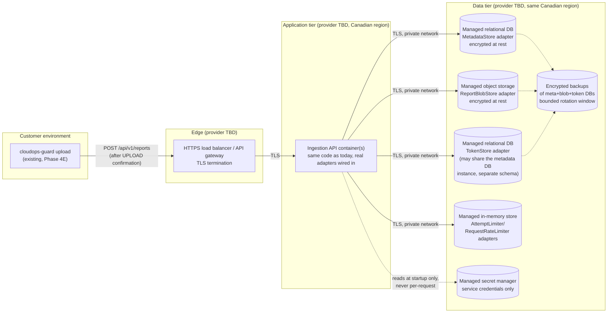

# CloudOps Guard ingestion API — production architecture (Phase 4F)

**This is a design and decision document, not deployment authorization.**
No provider, region, or resource has been selected or provisioned by this
document. Every recommendation below is explicitly labeled `Recommended
— pending explicit human approval`, mirroring `docs/deployment/
web-production.md`'s own repeated statement that documenting a
deployment procedure is not itself the authorization to run it. **No
infrastructure exists. No secret exists. No token has been issued. This
document authorizes nothing.**

**Correction — the exact required sequence, unambiguous**: provider and
region/data-residency selection is **not** a Phase 4G activity — it is a
precondition that must be satisfied *before Phase 4G may be authorized
to begin at all*, exactly as `docs/milestones/v0.4.0-ingestion-api.md`
§H states ("Region/data-residency selection is a mandatory decision
*before* Phase 4G"). The required order is:

1. Phase 4F (this document and its siblings) is independently reviewed
   and committed.
2. The user makes and records an explicit provider and region/
   data-residency decision (§3, §8 below) — never selected by this
   document or by any automated process.
3. Expected pilot cost and budget, priced against the actually-selected
   provider and region, are reviewed and approved by the user (§3 below).
4. Only once both of the above are recorded may Phase 4G itself be
   authorized to begin.
5. Phase 4G then implements, provisions, and deploys **only** the
   already-approved architecture — it does not itself make the
   provider/region/budget decision; it executes a decision already made
   and recorded before it started.

Provisioning resources in the already-approved provider and region,
deploying the service, and beginning the first real pilot remain
exclusively **within** Phase 4G's own execution — but Phase 4G itself
may not be authorized to *begin* until the provider/region/budget
decision above has already been made and recorded. See
`docs/pilots/phase-4g-authorization-checklist.md`, which states this
same ordering as an explicit precondition to starting Phase 4G, not an
activity performed during it.

**Summary of the boundary**: *before* Phase 4G is the human provider/
region decision, data-residency acceptance, a current provider-specific
cost estimate, and budget approval (§3, §8, `docs/pilots/
phase-4g-authorization-checklist.md`'s "Preconditions to authorizing
Phase 4G at all"). *During* Phase 4G is implementing real production
adapters, provisioning infrastructure in the already-approved region,
deploying the service, and executing the pilot (`docs/pilots/
phase-4g-authorization-checklist.md`'s "Phase 4G execution checklist").
Region *acceptance* — the human decision itself — is never a Phase 4G
activity; only provisioning *against* an already-accepted region is.

## 1. What is being deployed

The ingestion API (`src/cloudops_guard/ingestion_api/`) is a Python ASGI
application (no framework beyond `starlette`'s primitives — `app.py` is
a hand-written raw-ASGI dispatcher) requiring, per
`docs/milestones/v0.4.0-ingestion-api.md` §H:

- A durable, transactionally-atomic **metadata store** (backing
  `MetadataStore.create_or_get_received`'s single-lock dedup guarantee —
  §H is explicit that a separate find-then-write pair is insufficient).
- A durable **blob store** for raw report bytes (`ReportBlobStore`).
- A durable **token store** (`TokenStore` — `lookup_id` as a genuine
  indexed key, Argon2id hash only, never plaintext).
- A **persistent, distributed** attempt limiter (`AttemptLimiter`, the
  three-layer abuse-protection counters, §F) and **persistent,
  distributed** request-rate limiter (`RequestRateLimiter`, §G/§H) —
  both process-local today (§4F review's threat 11/12 dispositions);
  this is a known, explicit Phase 4G precondition, not yet built.
- Standard ASGI hosting for the application itself, capable of running
  `uvicorn`/an equivalent ASGI server behind TLS termination.

This is architecturally parallel to, but never merged with, the two
existing Phase 3K web deployment units (`docs/deployment/
web-production.md`) — its own domain/route, its own credentials, its
own codebase boundary, per §H's "separate service, separate security
boundary" design.

## 2. Candidate architectures

Three realistic pilot-scale approaches were compared. All three are
provider-neutral in the sense that none has been selected — this
section documents the comparison, not a commitment.

### Option A — Managed container platform + managed Postgres + managed object storage

A single small managed-container/serverless-container service running
the ASGI app (e.g. behind the provider's own HTTPS load balancer),
backed by a managed relational database (metadata store, using a real
transaction or `INSERT ... ON CONFLICT` for the atomic dedup primitive)
and managed object storage (blob store), with a managed in-memory
data-store product (e.g. a managed Redis-compatible service) backing
the two limiters.

- **Canadian region availability**: multiple major providers (AWS,
  Google Cloud, Azure, and others) offer a Canadian region (e.g.
  `ca-central-1`, `northamerica-northeast1`, `canadacentral`) with the
  full set of managed services this option needs.
- **ASGI compatibility**: direct — any container platform running a
  standard Python/uvicorn container is a drop-in fit; no code changes
  required beyond an entrypoint (Phase 4G work) wiring real adapters
  into `IngestionApiConfig`.
- **Managed relational/transactional metadata storage**: yes — this is
  the option's core strength; a real ACID transaction directly backs
  `create_or_get_received`'s atomicity requirement with no custom
  concurrency-control code needed.
- **Encrypted object/blob storage**: yes, standard managed offering,
  server-side encryption at rest by default on every major provider.
- **Persistent distributed rate limiting**: yes, via the managed
  in-memory data-store product (atomic increment/expire operations map
  directly onto `AttemptLimiter`/`RequestRateLimiter`'s needs).
- **Secret management**: yes, a managed secret-manager product is
  standard on every major provider in this category.
- **Backup encryption/bounded deletion**: yes — managed relational and
  object storage backup products support both, with a configurable
  retention/rotation window meeting §H's "bounded backup deletion"
  requirement.
- **Private service-to-storage networking**: yes, via the provider's own
  VPC/private-networking primitives — the ingestion service, database,
  object store, and rate-limiter store can all be placed on a private
  network with no public storage endpoint.
- **Operational complexity**: moderate — several managed services to
  provision and wire together, but each is a well-understood, widely-
  documented managed product, not custom infrastructure.
- **Estimated pilot-scale cost**: low-to-moderate — a single small
  pilot's traffic volume fits comfortably within the smallest tier of
  each managed product on every major provider; this is a qualitative
  comparison only, not a numerical estimate (see §3's own caveat below).
  Exact figures depend on the specific provider chosen; computing them
  is a mandatory step *after* the provider/region decision and *before*
  Phase 4G may be authorized to begin (§3, `docs/pilots/
  phase-4g-authorization-checklist.md`) — not a decision made during
  Phase 4G itself.
- **Portability/vendor lock-in**: moderate — the application code itself
  (`MetadataStore`/`ReportBlobStore`/`TokenStore`/`AttemptLimiter`/
  `RequestRateLimiter` interfaces, §H) is already provider-neutral by
  design; only the concrete adapter implementations (not yet written)
  would be provider-specific, and the interfaces were deliberately
  designed (§H, "future migration compatibility") to make swapping them
  out later a contained change.
- **Monitoring/incident-response support**: yes — every major provider
  in this category offers integrated metrics/logging/alerting.

### Option B — Serverless functions + managed Postgres + managed object storage

The same storage layer as Option A, but the ASGI application itself
runs as a serverless function (per-request or per-container-instance
billing) rather than an always-on container.

- **Canadian region availability**: same as Option A for the storage
  layer; serverless-function availability in a Canadian region varies
  by provider and is a Phase 4G-time verification item, not assumed
  here.
- **ASGI compatibility**: requires an ASGI-to-serverless-function
  adapter layer (most major providers offer one for Python ASGI apps),
  a small but real integration surface not needed in Option A.
- **Managed relational/transactional metadata storage**,
  **encrypted object storage**, **persistent distributed rate
  limiting**, **secret management**, **backup encryption/bounded
  deletion**, **private networking**: same as Option A — this option
  only changes how the *application* runs, not the storage layer.
- **Operational complexity**: lower for the application tier
  (no server/container lifecycle to manage directly) but adds the
  ASGI-adapter integration surface and generally less mature local-
  development parity than a plain container.
- **Estimated pilot-scale cost**: potentially lower at very low traffic
  volumes (pay-per-invocation), but with more cold-start-related latency
  variability, which matters more for an interactive uploader
  confirmation flow than it would for a batch job.
- **Portability/vendor lock-in**: higher than Option A — the ASGI-
  adapter integration is itself somewhat provider-specific, even though
  the application code underneath remains the same provider-neutral
  interfaces.
- **Monitoring/incident-response support**: same tier as Option A.

### Option C — Self-managed VM/container + self-managed Postgres

Running everything (application, database, object storage via a
self-hosted S3-compatible product) on raw compute the team manages
directly, rather than managed services.

- **Canadian region availability**: yes, in the sense that raw compute
  is available in a Canadian region on any major provider — but every
  other requirement below becomes the team's own responsibility to
  implement correctly, rather than inherited from a managed product.
- **ASGI compatibility**: direct (same as Option A).
- **Managed relational/transactional metadata storage**: **no** — this
  is the option's central weakness. A self-managed Postgres instance
  can still provide the same transactional guarantee `create_or_get_received`
  needs, but the team becomes responsible for its own backup
  automation, encryption-at-rest configuration, patching, and failover
  — none of which is inherited "for free" the way it is with a managed
  product.
- **Encrypted object storage**: possible via a self-hosted S3-compatible
  product, but again self-managed, not inherited.
- **Persistent distributed rate limiting**: requires self-hosting the
  in-memory data store too.
- **Secret management**: requires either self-hosting a secret-manager
  product or falling back to a weaker mechanism (e.g. environment
  variables injected at deploy time) — a real downgrade versus Options
  A/B.
- **Backup encryption/bounded deletion**: entirely the team's own
  responsibility to build and verify.
- **Private networking**: achievable via the provider's own VPC
  primitives even for raw compute, so this specific item is not
  meaningfully worse than Options A/B.
- **Operational complexity**: **highest** of the three — this option
  trades managed-product convenience for full control, which is not a
  good trade for a small pilot-scale service with no dedicated
  infrastructure/SRE team.
- **Estimated pilot-scale cost**: potentially lowest in raw
  compute/storage billing, but this ignores the real operational cost
  of the team's own time spent on database administration, backup
  verification, and security patching that a managed product would
  otherwise absorb.
- **Portability/vendor lock-in**: **lowest** of the three — genuinely
  the most portable option, since almost nothing is provider-specific
  beyond raw compute/block storage, which are close to commodities.
- **Monitoring/incident-response support**: requires self-hosting or
  separately subscribing to a monitoring product; not inherited.

## 3. Recommendation

**Recommended — pending explicit human approval: Option A** (managed
container platform + managed relational database + managed object
storage + managed in-memory data store), for a pilot-scale deployment.

**Rationale**: Option A gives the strongest match to §H's storage-
security requirements (TLS everywhere, encryption at rest for all
three of metadata/blobs/backups, least-privilege service credentials,
bounded backup deletion) with the *least* custom operational work to
get there — every one of those requirements is either a default or a
simple configuration toggle on a managed product, rather than something
the team must build and independently verify (Option C) or accept a
somewhat less mature integration surface for (Option B). For a small,
pilot-scale service with no dedicated infrastructure team, "inherit
correctness from a managed product" is the safer default than
"build and verify it ourselves," and Option B's serverless cold-start
latency is a genuine (if minor) UX concern for an interactive CLI
confirmation flow that Option A avoids entirely.

**Update — the provider/region decision has since been recorded**: the
user has selected **Microsoft Azure, Canada Central (`canadacentral`)**
(recorded 2026-09-09, `docs/pilots/phase-4g-authorization-checklist.md`,
`docs/deployment/azure-ingestion-production.md` §0). This recommendation
itself still names only an architecture *pattern* — it was never the
document that made the provider/region decision, and it is preserved
below unchanged as the pattern-level rationale that decision was made
against. See `docs/deployment/azure-ingestion-production.md` for the
concrete, Azure-specific architecture, cost estimate, and implementation
Phase 4G-A produced.

**Cost figures in §2 above are qualitative comparisons ("low-to-
moderate," "lowest," "highest"), not a numerical cost estimate — and
must never be read as one.** No actual pricing was looked up against
any specific provider's current rate card when this section was
originally written. **A current, provider-specific numerical cost
estimate now exists** — `docs/deployment/azure-ingestion-production.md`
§5, priced against Azure's own published Canada Central rates, together
with the approved CAD $100/month before-tax alerting ceiling — reviewed
and recorded per `docs/pilots/phase-4g-authorization-checklist.md`'s own
precondition item, distinct from selecting the provider/region itself.

**Managed-service availability claims in §2 above (e.g. "a Canadian
region," "a managed relational database," "a managed in-memory data
store") describe categories of product generally offered by major
providers, not a verified claim about any specific provider's current
offering.** Once a provider is selected, every such claim must be
re-verified against that provider's own authoritative, current
documentation before being relied on for a real deployment — provider
offerings, region availability, and product names change over time,
and this document's own comparison is a point-in-time judgment, not a
standing guarantee.

## 4. Proposed components (architecture-pattern level, no provider named)

## 5. Trust boundaries and data flows

- **Customer → edge**: TLS-terminated at the load balancer/gateway;
  never plaintext.
- **Edge → application tier**: private network hop (provider-internal),
  still TLS per §H's "every network hop" requirement.
- **Application tier → each data-tier component**: private network,
  TLS, using a **separate, least-privilege service identity per store**
  — the application's credential to the metadata DB grants only the
  operations `MetadataStore`'s interface exposes (no
  drop-table/admin-scope credential), and likewise for the blob store
  (put/get/delete-by-key only, no bucket-admin scope) and the token
  store (read/write the token table only).
- **Application tier → secret manager**: read-only, at startup only
  (service credentials to the other stores), never per-request, never
  logged.
- **No trust boundary crosses into `web/`**: this deployment unit
  remains architecturally isolated from the existing static-assets and
  contact-API units (§H, `docs/deployment/web-production.md` §1's own
  isolation reasoning applies identically here) — no shared credential,
  no shared network path, no shared codebase.

## 6. Service identities and permissions

- **Ingestion API service identity**: read/write on its own metadata-DB
  schema and token-DB schema, put/get/delete on its own object-storage
  bucket/prefix, read/write on the limiter store, read-only on its own
  secret-manager path at startup. No admin/IAM-management permission of
  any kind.
- **Backup/rotation identity** (if separate from the application's own
  identity, provider-dependent): write-only to the backup destination,
  with deletion permission scoped only to enforcing the bounded rotation
  window (§8) — never a general delete-anything credential.
- **Human operator identity** (manual token provisioning,
  `docs/manual-token-provisioning.md`): a separate, explicitly-audited
  identity with write access to the token store only, never used by any
  automated process.

## 7. Required secrets (names only, never values)

- Metadata-DB connection credential.
- Token-DB connection credential (may be the same physical database as
  metadata, under a separate schema/credential).
- Object-storage service credential.
- Limiter-store (managed in-memory data store) connection credential.
- TLS certificate/private key (if not fully managed by the load
  balancer/gateway product).

**No secret value is recorded anywhere in this repository, this
document, or any Phase 4F deliverable.** No secret has been created.

## 8. Region, retention, and backup design

- **Explicit region for every service, store, and backup — recorded**:
  Microsoft Azure, Canada Central (`canadacentral`), recorded 2026-09-09
  (`docs/pilots/phase-4g-authorization-checklist.md`). Phase 4G-A's own
  infrastructure-as-code (`infra/azure/`) hard-codes every data-bearing
  resource to this exact region — never a provider default, never split
  across regions — and this is structurally verified, not merely
  documented (`tests/ingestion_azure/test_bicep_infrastructure.py::
  TestRegionConstraint`). See `docs/deployment/
  azure-ingestion-production.md` for the concrete implementation.
- **Retention**: matches §C's proposed default (90 days from ingestion,
  automatic retirement, configurable per pilot agreement) —
  `IngestionApiConfig.retention_period`, already a constructor
  parameter today (`DEFAULT_RETENTION_PERIOD = dt.timedelta(days=90)`),
  requires no code change to honor a different pilot-specific value.
- **Backup-deletion design**: Azure Database for PostgreSQL Flexible
  Server's own automated backups are configured for an initial 7-day
  rotation window (`infra/azure/modules/postgresql.bicep`,
  `docs/deployment/azure-ingestion-production.md` §4/§6) — "we have a
  backup" is never treated as license to retain deleted data
  indefinitely, and that same document's §6 explicitly states the
  resulting maximum remaining backup window (up to 7 days after a
  confirmed primary purge) so `docs/pilots/
  ingestion-pilot-runbook.md` §16's own backup-rotation confirmation
  level can state it precisely rather than leaving it a Phase 4G
  unknown.

## 9. Rollback strategy

- **Application tier**: standard immutable-artifact rollback — deploy
  the previous known-good container image/artifact digest; no
  in-place mutation of a running deployment.
- **Data tier**: schema migrations (once a real metadata-DB schema
  exists, Phase 4G) must be backward-compatible for at least one
  release, so an application-tier rollback never requires a
  simultaneous, coordinated data-tier rollback.
- **No rollback strategy is exercised or tested by Phase 4F** — this is
  a design commitment for Phase 4G's own deployment-workflow
  implementation (§10 below), not something Phase 4F can test without
  infrastructure to roll back.

## 10. Disaster-recovery expectations (design-level, not yet implemented)

- **RPO (recovery point objective)**: bounded by the chosen managed
  database/object-storage product's own backup frequency — a specific
  numeric target is a Phase 4G decision once a provider's actual backup
  cadence options are known, not asserted here.
- **RTO (recovery time objective)**: bounded by how quickly a new
  application-tier instance can be provisioned against a restored data
  tier — again a Phase 4G numeric decision, not asserted here.
- **Update**: a disaster-recovery runbook now exists
  (`docs/deployment/azure-ingestion-production.md` §7: RPO 24h, RTO 8h,
  a restore-test procedure) — but the restore drill itself has not been
  executed. See §11 item 8 below.

## 11. Known blockers before Phase 4G (consolidated)

**Items 1–2 previously blocked *authorizing* Phase 4G at all — both are
now satisfied** (`docs/pilots/phase-4g-authorization-checklist.md`).
Items 3–10 are things Phase 4G itself must still build/provision or
verify; Phase 4G-A (`docs/deployment/azure-ingestion-production.md`)
has implemented deployable code and infrastructure-as-code for several
of them, but **created no Azure resource and verified nothing against a
live Azure subscription** — each item below states exactly what remains.

1. ~~Region/provider not selected~~ — **recorded**: Microsoft Azure,
   Canada Central (2026-09-09, `docs/pilots/
   phase-4g-authorization-checklist.md`).
2. ~~No provider-specific cost estimate or budget approval exists~~ —
   **recorded**: ~CAD $46–72/month estimate, CAD $100/month approved
   ceiling (`docs/deployment/azure-ingestion-production.md` §5).
3. **Real adapter implementations exist but are unverified against live
   Azure** — `src/cloudops_guard/ingestion_azure/` implements
   `MetadataStore`/`ReportBlobStore`/`TokenStore` against real
   PostgreSQL and Azure Blob Storage, tested against a real local
   PostgreSQL instance and a real local Azurite emulator only.
4. **Persistent, distributed `AttemptLimiter`/`RequestRateLimiter`
   implementations exist**, PostgreSQL-backed
   (`postgres_attempt_limiter.py`/`postgres_request_rate_limiter.py`),
   tested against real PostgreSQL including real concurrent-transaction
   races — same "never against live Azure" caveat as item 3.
5. **A production entrypoint exists**
   (`src/cloudops_guard/ingestion_azure/entrypoint.py`), proven in a
   real local container to fail closed without configuration and to
   serve real traffic when configured against a real local PostgreSQL
   instance — never run against real Azure infrastructure.
6. **No TLS certificate, secret manager entry, or service identity has
   been provisioned in a real Azure subscription.** Bicep definitions
   for all three exist (`infra/azure/modules/keyvault.bicep`,
   `managed-identities.bicep`) but define no resource until deployed.
   Separately: the Key Vault this Bicep provisions has no public network
   access at all (private-endpoint-only, by design), and no Bicep
   resource in this codebase is capable of writing a secret value into
   it — an approved, authenticated, audited execution environment
   already inside the trusted network boundary must exist before any
   real secret can be populated, and no such mechanism has been chosen
   yet (`docs/deployment/azure-ingestion-production.md` §9 step 5, §11
   item 9).
7. **Backup/rotation configuration is chosen but not yet tested against
   a real restore** — 7-day PostgreSQL backup retention
   (`infra/azure/modules/postgresql.bicep`); see item 8.
8. **A disaster-recovery runbook exists, but its restore drill has not
   been executed** (`docs/deployment/azure-ingestion-production.md`
   §7) — this remains a hard blocker until it has.
9. **A deployment workflow now exists**
   (`.github/workflows/deploy-ingestion-azure.yml`) — authored and
   locally validated (`actionlint`), **never dispatched**. §12 below is
   superseded by this real, executable workflow for the Azure
   implementation specifically.
10. **An audited, tenant-scoped, operator-only ingestion-inventory
    mechanism exists** (`src/cloudops_guard/ingestion_azure/
    inventory.py`, `ops_cli.py`), tested against real PostgreSQL
    including the pilot runbook's own tabletop scenario — never yet
    exercised against a live pilot customer's data; see
    `docs/pilots/ingestion-pilot-runbook.md` §16.

---

## 12. Deployment-workflow design (Phase 4G, not implemented here)

**Superseded, for the Azure implementation specifically, by a real,
executable workflow**: `.github/workflows/deploy-ingestion-azure.yml`
(Phase 4G-A) implements every stage this section describes, adapted for
Azure OIDC/workload identity and a container image instead of a static
site — see `docs/deployment/azure-ingestion-production.md` §1/§9. That
workflow has been authored and locally validated (`actionlint`) but
**never dispatched** — this section is retained below as the original,
provider-neutral design record it was always meant to be, not because
the design itself is still unimplemented.

This section documents the **exact proposed** Phase 4G deployment
workflow design. **No executable, provider-specific deployment workflow
is added by Phase 4F.** A validation-only artifact-build workflow (one
that builds and verifies an artifact but cannot push or deploy it) would
be permitted under this phase's own scope, but was judged unnecessary
to add speculatively ahead of provider selection — `ci.yml` already
builds and verifies the Python wheel/sdist on every push, which is the
only artifact this design currently produces; a container-image build
step would be provider/runtime-specific enough (base image choice,
registry target) that adding it before Option A vs. B vs. C is chosen
would risk committing to assumptions this document explicitly does not
make yet.

### Trigger and confirmation

- **Manual `workflow_dispatch` only** — never triggered automatically by
  a push, merge, tag, or schedule, mirroring `deploy-web.yml`'s own
  existing pattern exactly.
- **Exact typed production-confirmation input**: a required
  `workflow_dispatch` string input, checked byte-for-byte against a
  fixed phrase (e.g. `DEPLOY-INGESTION-PRODUCTION`) before any credential-
  free preflight job even begins, mirroring `deploy-web.yml`'s existing
  confirmation-phrase gate.
- **Exact commit SHA input**: a required 40-hex-character full commit
  SHA input, validated against the actual ref being deployed, so a
  dispatch can never silently deploy a different commit than the one an
  approver reviewed and typed.

### Approval and permissions

- **Protected GitHub Environment approval**: a `production` environment
  (not yet created by Phase 4F — creating one is explicitly excluded
  from this phase's scope) with required reviewers, exactly as
  `deploy-web.yml`'s own `production` environment already works for the
  web deployment units.
- **Least-privilege GitHub permissions**: `contents: read` at the
  workflow level (matching `deploy-web.yml`); no broader permission
  scope added.
- **OIDC/workload identity, never a long-lived cloud key**: the
  deployment job authenticates to the chosen cloud provider via GitHub's
  own OIDC federation (a short-lived, per-run token), never a stored
  long-lived access key/secret pair — this is a hard requirement of the
  design, not merely a preference, since a long-lived key checked into
  GitHub Environment secrets would itself become the kind of durable,
  broadly-scoped credential §F/§H's whole design tries to avoid for
  customer tokens.

### Stages (separate, in order)

1. **Build** — produce an immutable artifact (a container image or
   equivalent) from the exact reviewed commit SHA; tag it with its own
   content digest, never a mutable tag like `latest`.
2. **Verify** — run the full test suite, `ruff check`/`format --check`,
   and a dependency/secret audit against the exact artifact being
   deployed (not merely against source) — a build that has drifted from
   what was tested must never reach the next stage.
3. **Plan** — compute what would change (e.g. a migration dry-run once a
   real schema exists) without applying anything; surface the plan for
   the human approver to review before the Environment-protection
   approval gate.
4. **Approve** — the protected-Environment human approval gate itself;
   the plan from the previous stage is what the approver is actually
   approving.
5. **Deploy** — apply the plan; deploy the exact digest-pinned artifact
   built in stage 1, nothing rebuilt or re-resolved at this stage.

### Concurrency and safety

- **Concurrency protection**: a workflow-level `concurrency` group keyed
  on the deployment target, so two dispatches can never race against the
  same environment simultaneously.
- **Pre-deployment migration/compatibility checks**: the "Plan" stage's
  own output must be reviewed for any backward-incompatible schema
  change before "Approve" — no migration may run that would break the
  currently-running (pre-rollback) version, per §9's rollback
  requirement.
- **Health verification**: after "Deploy," an automated health check
  (e.g. `GET /api/v1/capabilities` against the newly-deployed instance,
  the one endpoint that requires no credential) must pass before the
  workflow reports success.
- **Automatic stop on failed verification**: a failed health check halts
  the workflow immediately and does **not** proceed to any subsequent
  step (e.g. traffic cutover, if a blue/green or canary pattern is used)
  — never a "deploy anyway" fallback.
- **Explicit rollback procedure**: documented as a *separate*,
  independently-dispatchable workflow input/mode (redeploy the
  immediately-prior digest), never an implicit side effect of a failed
  deploy — a human decides when to roll back, informed by the automatic
  stop above, rather than the workflow silently reverting on its own.

### Post-deployment verification

- **Post-deployment smoke tests using synthetic data only**: a small,
  fixed synthetic report (structurally identical to
  `tests/fixtures/ingestion_fingerprint_fixtures_v1.json`'s own
  entries) posted through a dedicated smoke-test token scoped to a
  non-production-data tenant, then immediately deleted — never a real
  customer's report, never real customer data of any kind.
- **Audit record**: every dispatch records, at minimum: the approving
  GitHub identity, the exact commit SHA and artifact digest deployed,
  the target region, and the final result (success/rollback/failure) —
  persisted as a workflow run's own permanent GitHub Actions log, the
  same durable audit trail `deploy-web.yml` already relies on.

**None of the above is implemented by Phase 4F.** This section is a
design specification for Phase 4G to build against, once a provider and
region are actually chosen and approved.
