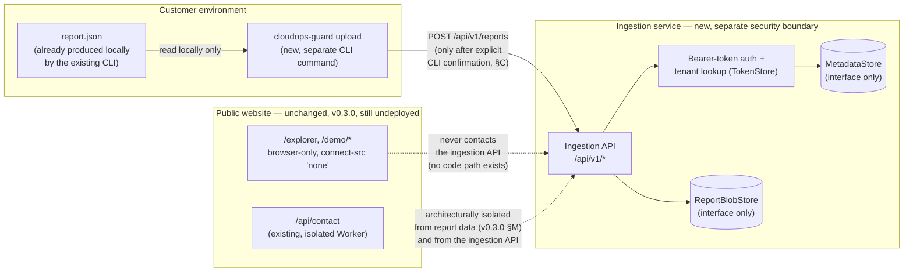

# Milestone v0.4.0: Versioned Ingestion API and Customer-Controlled Uploader

Status: **Phase 4A defines the v0.4.0 architecture and contracts, below.**
Phase 4A — this document, the `CLAUDE.md` update, and the roadmap update —
**is documentation and contract design only.** This document defines what
v0.4.0 will be before any of it is built, in the same spirit as
`docs/milestones/v0.3.0-interactive-web-demo.md`'s Phase 3A.

**Phase 4B (committed and pushed, commit
`363cdf179945d7c93b78a25edb7b7fc416ac8da8`) has implemented the storage
and token interfaces §H designs**, together with deterministic local,
in-memory reference implementations, under
`src/cloudops_guard/ingestion/` — see §H and §I for what this covers.

**Phase 4C (committed and pushed, commit
`90e2a8848b2df6fd3befeb83c737b06166866bc1`) has implemented real Argon2id
secret hashing/verification, the `lookup_id`/`secret` token structure, a
framework-independent authentication coordinator, per-scope authorization,
and the three-layer abuse-protection ordering §F specifies** — see §I for
what this covers, including its own security correction pass (token-bearing
value objects that resisted `repr`/`str` inspection but still leaked their
secret through `dataclasses.asdict()`; a public
`provision_token(..., hasher=...)` parameter that let a caller substitute
an insecure hasher whose output would be stored verbatim; and Argon2id
verification that did not check the encoded hash's own algorithm,
silently accepting a well-formed Argon2i or Argon2d hash — see
`CLAUDE.md`'s Phase 4C paragraph for the full description of each fix).
As of Phase 4C, still **no HTTP API endpoint, no network-reachable server,
no production credential store, no uploader, and no deployment
infrastructure exist** — Phase 4C was Python-only authentication
*mechanics*, exhaustively unit-tested, never a live endpoint or a real
customer credential.

**Phase 4D (committed and pushed, commit
`b35caf4b246c753a7ed8b62d4427468f312ba949`) has implemented
the four `/api/v1` endpoints (§E) against Phases 4B/4C's
interfaces** — see §I for what this covers, including the three
pre-authorized contract corrections it applied (a `request_id` field
added to the capabilities success response; the `ReportBlobStore.
put_if_absent` safe-reservation primitive; and the `RequestRateLimiter`
interface replacing `AttemptLimiter` for ordinary, non-failure request
volume). **This is a local/staging-only implementation, not a production
service**: it exists only as code a caller (a test, or a developer
running it themselves) can start under an ASGI server on an explicitly-
chosen loopback address — no network-reachable or customer-reachable
endpoint, no real customer token, no production storage, no uploader CLI,
and no deployment infrastructure exist. **A subsequent, narrow Phase 4D
correction pass** (also uncommitted) fixed six independently-reproduced
issues: an unsafe blob-deletion ordering in `lifecycle.
purge_retired_ingestion` that could destroy a still-`received` record's
report bytes before validating its status; incorrect rejection of
`report_schema_version: 1.0` (a JSON number with an integer value, which
this contract accepts) alongside an unsafe integer or non-finite number
anywhere in a report reaching RFC 8785 canonicalization uncaught as a
`500`; header handling that silently resolved a repeated `Authorization`/
`Content-Type`/`Content-Length` header to only its first occurrence
instead of rejecting the ambiguity; route dispatch that collapsed empty
path segments, letting `/api/v1/capabilities/`-style variants alias a
real route; every handler running Argon2id authentication, report
validation, fingerprinting, and store I/O directly on the event loop,
serializing concurrent requests behind one another; and the absence of
the shared, versioned RFC 8785 fingerprint fixture set §I's own Phase 4D
acceptance gate requires for Phase 4E. **A second, final, narrow Phase 4D
correction pass** (also uncommitted) fixed four further
independently-reproduced issues: a residual check-then-act race in purge
eligibility (a since-reused `(tenant_id, ingestion_id)` identity's live
blob could still be destroyed after the first pass's own fix, via
tombstone expiry or two concurrent purgers), closed with an exclusive,
generation-scoped purge-claim mechanism; `POST /api/v1/reports` reading
the request body before authentication had succeeded, contradicting the
code's own comment, closed by reordering authentication strictly before
`read_bounded_body`; an unguarded `config.clock()`/candidate-construction
call between a successful blob reservation and metadata creation that
could leak the reservation on failure, closed with its own cleanup
`try`/`except`; and a bare `RecursionError` a ~1,000-level-deep document
could raise past `strict_decode_json`, closed with an iterative,
depth-bounded document walk and defensive `RecursionError` catches at
`json.loads` and the RFC 8785 fingerprint backstop. **A third, final
Phase 4D purge-claim hardening pass** (also uncommitted) fixed three
further defects in the second pass's own claim protocol, and corrects
that pass's own "closed with an exclusive, generation-scoped purge-claim
mechanism" language above: it closed the two races that pass itself
reproduced, but a generation-only claim identity still let releasing an
old, already-superseded claim cancel a different, currently active one
(and let a released claim still finalize); `mark_purged` — preserved,
unused by `lifecycle.purge_retired_ingestion`, but still part of the
same `MetadataStore` — could bypass the claim protocol entirely; and
`purge_retired_ingestion` itself could leak a claim on a clock,
timestamp-validity, or finalize failure. Fixed by adding a
globally-unique `claim_id` to `PurgeClaim` (compared together with
`generation`, never alone), by having `mark_purged` refuse to run while
an exact claim is active, and by moving timestamp/candidate validation
into `begin_purge` itself (atomically with claim acquisition, so a
validation failure can never leave a claim dangling) with every
remaining step wrapped to release exactly its own claim on any
exception. See `CLAUDE.md`'s Phase 4D paragraph for the complete
description of each fix, including its mutation-verification and final
test counts.

**Phase 4D — the original implementation and all three correction
passes above — has since been reviewed, approved, committed, and
pushed** to `main`: commit `b35caf4b246c753a7ed8b62d4427468f312ba949`
(`feat: add versioned ingestion API`), plus a narrow CI-restoration
follow-up, `d85879051c8b61c3f022195dc5513663df19acce` (`ci: restore
full workflow coverage`), fixing two pre-existing CI gaps this
milestone's own first push exposed — `ci.yml` never installed the `api`
optional-dependency group, and Web CI's dependency-audit gate had newly
started failing on an unrelated `fast-uri` transitive-dependency
advisory (resolved with an ordinary `npm audit fix`, no override). Both
`CI` and `Web CI` are green on `HEAD == origin/main`. **Phase 4E — the
customer-controlled CLI uploader — has since been implemented,
uncommitted, pending independent review.** See `CLAUDE.md`'s own Phase
4E paragraph for the complete description: `cloudops-guard upload
--report-dir <dir> --endpoint <url>`, requiring exact `UPLOAD`
confirmation (or `--yes`) before any network activity, `--dry-run`
performing zero network activity and requiring no credential, and a
pre-authorized dependency-boundary correction relocating the
authoritative RFC 8785/strict-JSON fingerprint implementation (and
`rfc8785` itself) out of the `api`-extra-gated `cloudops_guard.
ingestion_api` package and into the dependency-free `cloudops_guard.
ingestion` package, so uploading never requires installing that extra.
148 new tests (2189 total pytest); all 8 of this pass's own named
high-risk mutations were independently verified caught. Phase 4F has
not begun.

v0.3.0 is complete: all of Phases 3A–3K are committed and pushed to `main`
(commit `87376002553b24f21a0331c708986222a005a62d`, `CI` and `Web CI` both
green — see `CLAUDE.md`). **Nothing from v0.3.0 has been deployed** — the
website exists only as a validated build artifact and a not-yet-dispatched
deployment workflow. v0.4.0 does not change that: it adds a wholly separate
capability alongside the still-undeployed website, not a replacement for it.

## A. Objective and product context

CloudOps Guard's CLI (v0.1.0 Kubernetes audit, v0.2.0 GitLab CI/CD audit)
already produces a local `report.json`/`report.html` pair on the machine
that ran the audit. v0.3.0 added a way to *explore* that file — entirely in
a browser tab, never transmitted anywhere. Neither release gives a customer
any way to deliberately send a report to CloudOps Guard itself: there is no
endpoint that accepts one, by design (`docs/milestones/
v0.3.0-interactive-web-demo.md` §L, §P; `web/src/pages/privacy.astro`).

v0.4.0 introduces that capability for the first time, as an explicit,
customer-initiated action: a versioned HTTP ingestion API a customer's own
infrastructure can call, and a CLI uploader subcommand that calls it only
when a human (or an explicitly authorized CI job) deliberately runs it. This
exists to support a future, not-yet-scoped capability — a persistent,
cross-scan view of a customer's audit history — without building that
capability now. **Phase 4A defines the contract only.** Implementing the
API, provisioning storage, issuing tokens, building the uploader, and
deploying any of it are separate, later phases (§I), each requiring its own
explicit approval before it starts, exactly as this project has required for
every phase since v0.1.0.

## B. Scope and non-goals

**In scope for v0.4.0 as a whole** (not all in Phase 4A — see §I for which
phase implements what):

- A versioned HTTP report-ingestion API (`/api/v1`, §E).
- An explicit, customer-controlled CLI uploader subcommand.
- Ingestion of the two report types the product already produces: the
  Kubernetes `AuditReport` contract (v0.1.0) and the GitLab
  `GitLabAuditReport` contract (v0.2.0) — no new report type, no new check.
- Pilot-scale, customer-scoped bearer-token authentication (§F).
- A documented threat model and proposed architecture for the ingestion
  service, including storage *interfaces* (§G, §H).

**Explicit non-goals for v0.4.0:**

- **No persistent multi-tenant dashboard.** The ingestion API stores what a
  customer sends; nothing in this milestone builds a UI to browse it. That
  is a distinct, unscoped future milestone, not implied or promised here.
- **No automatic or browser-triggered uploads, of any kind, ever.** Nothing
  in the website (`web/`), the demo/explorer routes, or a normal
  `cloudops-guard audit ...` CLI invocation may cause a report to reach the
  ingestion API. Only a separate, explicitly-invoked uploader command may.
- **No AKS/EKS-specific integrations.** Out of scope for this milestone, as
  for v0.3.0.
- **No expansion of cost-analysis scope** beyond the two GitLab
  cost-efficiency checks (`GL-COST-001`, `GL-COST-002`) already released.
- **No accounts, billing, SSO, or self-service token issuance UI.** §F's
  bearer tokens are pilot-scale and provisioned out of band (mirroring how
  this project already provisions the GitLab
  `CLOUDOPS_GUARD_GITLAB_TOKEN` — manually, out of band, never through a
  self-service flow this codebase implements).
- **No change to the released Kubernetes or GitLab report contracts**
  (`AuditReport`, `GitLabAuditReport`, `report.json`/`report.html`
  generation). The ingestion API is designed to accept those contracts
  exactly as they already exist — see §D and §H's reuse analysis.
- **No change to any v0.3.0 website behavior, route, CSP, or invariant.**
  §C restates why this is a hard requirement, not just an intention.
- **Phase 4A itself implements nothing**: no API code, no storage
  provisioning, no authentication code, no uploader code, no deployment
  infrastructure, no Cloudflare resource, no external service account. See
  §I for the phases that will, each separately gated.

## C. Privacy boundary

**The v0.3.0 website's existing privacy invariants are unchanged and must
remain true**, regardless of anything in this document:

- Local report exploration (`/demo/*`, `/explorer`) remains **browser-only**.
  Selecting or opening a file in those routes must never cause network
  activity — the existing `connect-src 'none'` CSP on those routes (§L of
  the v0.3.0 milestone doc) is unaffected and is not weakened, extended, or
  given any new exception by this milestone.
- **There is still no report-ingestion endpoint reachable from the
  website.** The ingestion API this document defines is a **separate
  service, on separate infrastructure, under a separate security
  boundary** from `web/` (§H) — it is not a new Worker route added to the
  existing site, and nothing in `web/` may ever construct a request to it.
  `web/src/pages/privacy.astro`'s statement "No endpoint on this site
  accepts an uploaded report, file, or credential" remains true of *the
  website* after v0.4.0 ships, because the ingestion API is not part of
  "this site."

**The new invariant v0.4.0 introduces** — for the CLI uploader specifically,
never for the website:

- **Uploading is never automatic.** A normal `cloudops-guard audit
  kubernetes ...` / `cloudops-guard audit gitlab ...` invocation writes
  `report.json`/`report.html` locally exactly as it does today and performs
  no network activity beyond what auditing itself requires (the Kubernetes
  API / GitLab API calls those commands already make). Producing a report
  and uploading a report are two separate, deliberate actions; running the
  first never triggers the second.
- **Uploading requires a separate CLI command.** Proposed:
  `cloudops-guard upload --report-dir <dir> [flags]`. This command exists
  only from the phase that implements it (§I); Phase 4A defines its
  contract, not its code.
- **No capabilities call, identity/authentication check, or upload request
  may occur before confirmation.** Every action the uploader takes before
  an exact typed `UPLOAD` (or `--yes`, which explicitly stands in for it —
  see below) is **local-only and performs zero network activity of any
  kind** — not a `GET /api/v1/capabilities` call (even though that
  endpoint is unauthenticated and would otherwise seem "safe" to call
  early), not an authentication check, not a partial or speculative upload.
  This is a hard ordering guarantee, not merely a recommendation: nothing
  before confirmation may depend on server state, because nothing before
  confirmation is permitted to contact the server at all.
- **Uploading requires explicit confirmation** in every interactive
  invocation. Proposed flow:
  1. The command locates and validates the report file(s) in
     `--report-dir` **locally**, exactly as the browser explorer already
     validates a selected file (reusing the same schema each report type
     already has — see §H's reuse analysis), and locally computes the
     exact `report_fingerprint` (§E.0) it would send — this step performs
     **no network activity** and requires no credential to be configured.
  2. It prints a summary of what would be sent, built **entirely from
     locally-available information**: platform, the locally-configured
     target endpoint (a config value, never fetched), finding count,
     severity summary, file size, and the locally-computed
     `report_fingerprint`. **It never prints a server-derived tenant
     display name** — the uploader has not contacted the server yet, so it
     has no server-verified tenant identity to show. An operator *may*
     optionally configure a purely local, freeform alias for a credential
     in the uploader's own local config (e.g. a label like `"prod-token"`)
     purely for the operator's own recognition; if configured, it is
     printed **explicitly labeled as a non-authoritative local alias**
     (e.g. `local alias: "prod-token" (not verified against the server)`)
     — never presented as, or confused with, the server's own tenant
     record. The prompt reads: `Type UPLOAD to confirm sending this report
     to <endpoint>: ` (naming only the configured endpoint, never a tenant
     name the uploader cannot yet vouch for).
  3. Only an exact `UPLOAD` response proceeds past this point. Any other
     input, including a blank line or Ctrl-C, aborts with no request sent
     and a non-zero exit code. Only *after* this confirmation may the
     uploader contact the server at all — first authenticating and
     ingesting via `POST /api/v1/reports` (optionally preceded by a
     `GET /api/v1/capabilities` call, now that contacting the server is
     permitted, to pre-validate `report_schema_version` support before
     spending the ingestion call — implementation detail left to Phase 4E,
     not mandated by this contract).
- **`--dry-run` is a required, always-available flag.** It performs exactly
  step 1 and 2 above — full local validation, local fingerprint
  computation, and a printed summary of what would be sent — and then
  exits **without ever making a network request, without ever prompting
  for confirmation, and without requiring any credential to be
  configured**. `--dry-run` produces byte-for-byte the same
  `report_fingerprint` value the server would independently compute for
  the same input (§E.0) — this is what makes dry-run output directly
  checkable against a real ingestion later, and is exactly why no network
  round-trip is needed to produce it.
- **Non-interactive / CI behavior**: an interactive confirmation prompt is
  not viable in a CI job. A `--yes` flag (mutually exclusive with
  `--dry-run`) explicitly opts out of the interactive prompt, standing in
  for a human's typed `UPLOAD` — but **`--yes` must still perform step 1 in
  full** (local validation and fingerprint computation, still zero network
  activity) before sending anything, and must still print the same
  pre-upload summary to stdout/CI logs (still no server-derived tenant
  name, still no token) so a CI run's logs remain auditable. Running the
  command **non-interactively** (`stdin` is not a TTY) **without `--yes`
  and without `--dry-run` fails closed** with a clear, non-zero-exit
  error — it must never silently fall back to "assume yes" or hang waiting
  for input that will never arrive.

**Retention, deletion, and logging** (policy the ingestion service must
implement once built — §I; not implemented in Phase 4A):

- **Retention**: an ingested report is retained until the earlier of (a) a
  fixed maximum retention period from ingestion (proposed default: 90
  days, configurable per pilot agreement — not a value this document treats
  as final product policy), triggering **automatic** retirement, or (b)
  the customer's own `DELETE /api/v1/reports/{ingestion_id}` request
  (§E.4). There is no indefinite-by-default retention, and a customer need
  not call anything for (a) to happen — see §E.4 for the automatic
  retention-expiry transition.
- **Retirement and deletion**: a report's end-of-life — whether
  customer-requested or automatic on retention expiry — is a durable
  commitment, not merely a soft flag, but it is also never claimed to be
  instantaneous. See §E.4 for the complete, precise definition: the full
  ingestion status enum and its transitions (including the automatic
  retention-expiry path), how a record's field names stay truthful
  regardless of which of the two triggers caused retirement, how backups
  are bounded separately from primary storage, how long a "tombstone" is
  retained, and the exact repeated-`DELETE` behavior during and after that
  retention window. In summary: retirement (by either trigger) is
  recorded synchronously — the record immediately becomes unreadable via
  `GET` — but the underlying bytes' physical, irreversible purge from
  primary storage completes asynchronously, within a bounded window
  (proposed: 30 days) — and the response **never claims physical deletion
  has occurred before it has**.
- **Logging**: ingestion-service logs may record `request_id`,
  `ingestion_id`, an opaque `tenant_id`, timestamps, `report_fingerprint`,
  status, `reason` (once retired), byte size, HTTP status, and latency.
  Logs **must never** contain report content (findings, evidence, resource
  names, cluster/project identifiers), the bearer token value (in any
  form, including a prefix longer than needed for support correlation),
  or any field submitted in a request body beyond what is listed above —
  mirroring this project's existing "never log authentication headers" /
  "never log report fields" discipline (`CLAUDE.md`, GitLab and web
  invariants). The uploader CLI itself must never place a token on a
  command line where it would appear in shell history or `ps` output (§F)
  or in its own printed pre-upload summary.

## D. Versioning contract

**Two independent version axes — never conflated:**

1. **API major version**, in the URL path: `/api/v1/...`. This versions the
   *HTTP contract itself* — endpoint shapes, required headers, error
   envelope, authentication mechanism. A breaking change to any of those
   requires a new path prefix (`/api/v2`), never an in-place change to
   `/api/v1`'s behavior.
2. **Report schema version**, carried as an explicit field in the request
   envelope (`report_schema_version`, §E) — never inferred from the URL.
   This versions the *shape of the report payload itself* for a given
   platform. `report_schema_version: 1` corresponds to the Kubernetes
   `AuditReport` / GitLab `GitLabAuditReport` contracts exactly as released
   in v0.1.0/v0.2.0 (§H's reuse analysis) — those contracts are not
   changing for v0.4.0, so `1` is the only value Phase 4A's contract
   defines, but the field exists from day one so a *future* report-contract
   change never requires an API version bump.

These two numbers vary independently, by design: `/api/v1` is expected to
outlive several report-schema-version increments (a new check field added
in a future report-generating release would raise `report_schema_version`
without touching the API contract), and `/api/v1` could in principle be
retired in favor of `/api/v2` while `report_schema_version` stays at `1`
throughout (e.g. an authentication-mechanism change with no report-shape
change). A worked example:

| API version | report\_schema\_version | Meaning |
|---|---|---|
| `v1` | `1` | Initial pilot contract — this document. |
| `v1` | `2` (hypothetical, future) | A future report-contract change, accepted by the same `/api/v1` HTTP contract. |
| `v2` (hypothetical, future) | `1` | A future HTTP-contract change (e.g. a new auth mechanism), still accepting the original report shape. |

**Compatibility and deprecation policy:**

- An API major version, once released, supports a documented, explicit set
  of `report_schema_version` values — never "whatever the server happens to
  accept today." Adding support for a new `report_schema_version` value to
  an existing API version is additive and non-breaking. Removing support
  for one requires an announced deprecation window (proposed: minimum 90
  days' notice before an ingestion request using a still-listed-as-
  supported schema version starts being rejected).
- Retiring an entire API major version (e.g. `/api/v1` itself) requires its
  own, separately announced deprecation window, independent of any single
  `report_schema_version`'s deprecation.

**Unsupported-version error behavior**: deterministic and never silent.

- An unrecognized API version segment in the path (anything other than
  `v1`) is a `404` with error code `unsupported_api_version` — the request
  never reaches version-specific routing logic.
- A syntactically valid but unsupported `report_schema_version` value in an
  otherwise well-formed request is a `400` with error code
  `unsupported_report_schema_version` — **using the same fixed, minimal
  error envelope every other error response uses** (§E's opening
  paragraph): `{ "ok": false, "error": "unsupported_report_schema_version",
  "request_id": "<opaque-id>" }`, and nothing more. It does **not** name the
  currently-supported values in the error response itself — doing so would
  contradict the fixed-envelope guarantee every other error already
  honors, by carrying response-specific extra data no other error code
  carries. A client that needs to know which values are currently
  supported calls `GET /api/v1/capabilities` (§E.1), which already exists
  precisely to answer that question, unauthenticated, before or after
  encountering this error — never a silent best-effort reinterpretation as
  a different schema version.

**Content type**, enforced identically to this project's existing
`POST /api/contact` Worker (`web/worker/contact.ts`): exact
`Content-Type: application/json` required — any other value, including a
missing header or a `application/json; charset=...` parameterized variant,
is rejected with `415 unsupported_content_type`. Any `Content-Encoding`
header is rejected outright (`415 unsupported_content_encoding`) — the
ingestion API never decompresses a request body itself.

**Two separate size limits — never conflated, exactly as the API version
and report schema version above are never conflated:**

1. **`MAX_REPORT_BYTES = 10 * 1024 * 1024` (10,485,760 bytes)** — the
   maximum size of the **`report` field's own value**, preserving the
   existing browser-explorer precedent exactly
   (`MAX_REPORT_FILE_BYTES`, `web/src/features/report-import/
   constants.ts`, currently also `10 * 1024 * 1024`). **The representation
   measured** is the UTF-8 byte length of a *compact* re-serialization of
   the parsed `report` value — `json.dumps(report, separators=(",", ":"))`
   in Python terms, i.e. valid JSON with no insignificant whitespace, but
   **not** the RFC 8785 canonical form used for fingerprinting (§E.0) and
   **not** a raw substring of the request body (JSON parsing has already
   discarded the original byte-for-byte formatting by the point this check
   runs). Compact re-serialization and RFC 8785 canonicalization are two
   independent, purpose-specific representations of the same parsed value —
   one for a cheap size check, one for a stable cross-implementation
   fingerprint — and this document is explicit about which is which so an
   implementation cannot accidentally conflate them.
2. **`MAX_REQUEST_BODY_BYTES = MAX_REPORT_BYTES + 4096 = 10,489,856
   bytes`** — the maximum size of the **entire HTTP request body**: the
   full JSON envelope, including `platform`, `report_schema_version`,
   `idempotency_key`, and all JSON structural characters (braces, quotes,
   colons, commas, key names). The `+ 4096` (4 KiB) is a generous, fixed
   bound on envelope overhead beyond the report itself (the largest
   envelope field besides `report` is `idempotency_key`, capped at 200
   characters) — never a rounding error waiting to reject a legitimately
   10 MiB report wrapped in its required envelope. **This is the limit
   enforced first, on raw wire bytes**, exactly as `readBoundedBody`
   already does for the contact Worker: a declared `Content-Length` above
   this limit is rejected before any read (`413 payload_too_large`), and
   the body is additionally read incrementally with a hard stop the
   instant actual bytes exceed this limit — covering a chunked or
   dishonest request alike. `request.text()`/`request.json()` (an
   unbounded whole-body read) must never be called.

`MAX_REPORT_BYTES` is checked **second**, after `MAX_REQUEST_BODY_BYTES`
has already bounded the read and the body has been JSON-parsed — a request
that individually passes the wire-level check but whose `report` value
alone (compactly re-serialized) exceeds `MAX_REPORT_BYTES` is rejected the
same way (`413 payload_too_large`), distinct from an envelope that is
merely malformed (`400 invalid_request`, checked separately). `GET
/api/v1/capabilities` (§E.1) reports both limits by name, never only one.

## E. API contract

All endpoints are under `/api/v1`. Every response is `application/json`.
Every error response uses the fixed envelope `{ "ok": false, "error":
"<code>", "request_id": "<opaque-id>" }` — never an echoed input value, a
validation-library issue list, a native exception message, a stack trace,
or any other infrastructure detail. `request_id` is a fresh,
server-generated opaque identifier on every request (success or failure),
present so a customer can reference a specific request when asking for
support without either party needing to share request content.

### E.0 Strict input validation and deterministic report fingerprint

**Strict decoding rules, applied before anything else in this section —
before schema validation and before fingerprinting — because a value read
by an ambiguous or lossy JSON decode is not a value this contract can
safely reason about at all:**

- **Reject duplicate object-member names.** The JSON text is decoded with a
  parser configured to detect a repeated key within the *same* object and
  reject the whole request (`400 invalid_request`) the instant one is
  found — never the "last key wins" behavior most JSON libraries default
  to, which silently discards the earlier value before this contract ever
  sees it. This check applies at **every** object level in the decoded
  document — the top-level envelope and every nested object inside
  `report` alike — not the envelope alone. (Python's `json.loads` accepts
  an `object_pairs_hook`; a hook that raises on a repeated key among the
  pairs it receives is sufficient. Any other implementation language's
  strict-duplicate-key decoding facility is equally acceptable — the
  requirement is the outcome, not a specific library call.)
- **Reject `NaN`, `Infinity`, and `-Infinity`.** RFC 8259 (the JSON
  specification RFC 8785 itself builds on) does not define these as valid
  JSON literals at all. Some JSON libraries — Python's built-in `json`
  module among them — accept them anyway as a non-standard extension
  unless that extension is explicitly disabled (in Python:
  `json.loads(text, parse_constant=<a function that raises>)`). This
  extension must be disabled in every implementation; a request containing
  any of these three tokens anywhere in its JSON text is `400
  invalid_request`.
- **Reject malformed or invalid Unicode.** A JSON text containing invalid
  UTF-8 byte sequences, or a string value containing an unpaired/lone
  surrogate, is rejected outright (`400 invalid_request`) — mirroring the
  strict-UTF-8-decode pattern this project's existing contact Worker
  already uses (`decodeUtf8Strict`, `web/worker/contact.ts`, built on
  `new TextDecoder("utf-8", { fatal: true })`), never silently substituted
  with a replacement character or otherwise lossily repaired.
- **Reject an incorrect envelope value type for any field.** `platform`
  must be exactly the JSON string `"kubernetes"` or `"gitlab"` (never a
  number, a boolean, or a differently-cased string). **`report_schema_
  version` must be a JSON number with an integer value — a numeric string
  such as `"1"` is invalid and is rejected, never coerced.** `report` must
  be a JSON object. `idempotency_key`, if present at all, must be a JSON
  string. Any type mismatch on any of these four fields is `400
  invalid_request`.

**Validation order, strictly enforced**: (1) the strict-decode rules above
(duplicate keys, `NaN`/`Infinity`, malformed Unicode, wrong field types);
then (2) the closed-envelope unknown-field check (§E.2); then (3)
platform-specific `report` schema validation (§E.2); only once all three
have succeeded does (4) `report_fingerprint` computation, below, ever run.
An input ambiguous or invalid under (1)–(3) must never reach fingerprint
computation at all — computing a fingerprint over an interpretation of the
input that a stricter decode would have rejected (e.g. treating a
duplicate-key object as "whichever value happened to survive") would let
two genuinely different payloads collide on a fingerprint neither of them
was actually, unambiguously sent as.

Every ingestion that passes the four steps above is identified by a
single, deterministic `report_fingerprint` value, computed identically by
the uploader (before sending anything, including during `--dry-run`, §C)
and by the server (upon receipt) — the same input always produces the same
fingerprint, on either side, with no coordination required between them.
This is what lets an operator compare a `--dry-run`'s printed fingerprint
directly against a real ingestion's response later, and is the sole basis
for the idempotency semantics below.

**Inputs**: exactly three values — `platform`, `report_schema_version`, and
`report` — the same three envelope fields §E.2 defines. The fingerprint
covers all three together, deliberately, not `report` alone: two requests
with byte-identical `report` content but a different `platform` or
`report_schema_version` are, by design, two different fingerprints, never
silently treated as the same ingestion.

**Canonicalization standard**: [RFC 8785, the JSON Canonicalization Scheme
(JCS)](https://www.rfc-editor.org/rfc/rfc8785) — a complete, precise,
publicly specified standard (sorted object keys, a fixed number
serialization, no insignificant whitespace) chosen specifically so this
contract does not need to invent or informally describe its own
canonicalization rules, and so independent implementations (the uploader
CLI, the server, and this document's own conformance tests) can each use an
off-the-shelf RFC 8785 implementation in their own language and be
guaranteed to agree.

**Exact algorithm**:

1. Construct the JSON object `{"platform": platform, "report_schema_version":
   report_schema_version, "report": report}` — using `platform` and
   `report_schema_version` exactly as given in the envelope, and `report`
   exactly as given (the parsed value, before any server-side normalization
   such as summary recomputation).
2. Serialize that object using RFC 8785 JCS, producing a canonical UTF-8
   byte sequence.
3. Compute `SHA-256` over those bytes.
4. `report_fingerprint = "sha256:" + <lowercase hex digest>`.

**Uploader/server equivalence is testable, not merely asserted**: because
the algorithm above is a pure function of three values every party already
has (the uploader has them locally before sending; the server has them from
the parsed request), a conformance test suite — required as an acceptance
gate for the phase that first implements both sides (§I, Phase 4D/4E) —
must feed the same representative set of *valid, already-accepted*
`(platform, report_schema_version, report)` tuples through an uploader-side
implementation and a server-side implementation and assert byte-identical
`report_fingerprint` output for every tuple, including genuine RFC 8785
edge cases: Unicode content in `report` (multi-byte characters, combining
sequences, right-to-left text), deeply nested findings, and numeric values
whose *canonical* serialization RFC 8785 specifically defines (§3.2.2.3's
ECMAScript-based number-to-string algorithm — e.g. how a JSON number
written as `1.0` in source canonicalizes identically to `1`). **This suite
is for fingerprint *equivalence* on inputs both sides have already accepted
as valid** — it is a distinct, separate requirement from the strict-decode
*rejection* tests above (a duplicate-key envelope, `report_schema_version:
"1"` as a numeric string, a bare `NaN`/`Infinity` literal, or malformed
Unicode): those inputs are invalid and must never reach fingerprint
computation on either side at all, so there is no "expected fingerprint"
for them to agree on — the corresponding acceptance-gate tests for those
assert `400 invalid_request` from the server and an equivalent local
rejection from the uploader, not fingerprint equality.

This replaces and formalizes the informal "canonicalized the same way"
language an earlier draft of this document used for a field then named
`content_hash`, which specified content-only hashing with no cited standard
and no stated cross-implementation equivalence requirement — see
"Idempotency semantics" below for how `report_fingerprint` is used, and
`MetadataStore.create_or_get_received` (§H) for the corresponding,
concurrency-safe storage interface.

### E.1 `GET /api/v1/capabilities`

Unauthenticated. Lets an uploader (or an operator) discover what the
service currently supports before attempting to authenticate or upload
anything.

**Response `200`:**

```json
{
  "ok": true,
  "api_version": "v1",
  "request_id": "req_<opaque>",
  "supported_report_schema_versions": {
    "kubernetes": [1],
    "gitlab": [1]
  },
  "max_report_bytes": 10485760,
  "max_request_body_bytes": 10489856,
  "max_findings_per_report": 10000
}
```

`request_id` is present here for the same reason every other response
carries one (§E's opening paragraph: "a fresh, server-generated opaque
identifier on every request, success or failure") — this example was
corrected during Phase 4D implementation to include it; an earlier
revision omitted it inconsistently with that global invariant. No
authentication state, tenant information, rate-limit budget, or
infrastructure detail is ever included here — this endpoint is safe to
call before any credential exists.

**Error responses**: `405 method_not_allowed` (any method other than
`GET`, with an `Allow: GET` header — mirroring `web/worker/contact.ts`'s
existing pattern exactly); `429 rate_limited` (this endpoint has no token
to scope a per-token limiter against, so it is instead covered by the
source-scoped Layer 2 abuse protection, §F); `500 internal_error`.

### E.2 `POST /api/v1/reports` — report ingestion

Authenticated (§F). Request body:

```json
{
  "platform": "kubernetes",
  "report_schema_version": 1,
  "report": { "...": "the existing report.json content, verbatim" },
  "idempotency_key": "optional, client-supplied, <=200 chars"
}
```

**The request envelope is a closed set of exactly these four top-level
fields — `platform`, `report_schema_version`, `report`, `idempotency_key` —
and nothing else.** Any top-level field not in this set (including,
explicitly, a `tenant_id`, `customer_id`, or any other field that names an
identity) causes the entire request to be rejected as `400
invalid_request`, before any other validation runs. Unknown fields are
**never** silently ignored, silently stripped, or silently accepted — this
is a strict/closed schema, not a permissive one that merely documents the
fields it happens to read.

- `platform` is required and explicit — `"kubernetes"` or `"gitlab"` —
  **never inferred from the presence or absence of a `platform` key inside
  `report`** the way the browser's `parseReport` dispatch does (§D). This
  envelope-level field exists specifically because the Kubernetes
  `AuditReport` contract carries no self-describing `platform` field at
  all (§H); the ingestion API cannot rely on body-sniffing the way the
  browser safely can for its own, purely local purpose. The server-side
  validator still independently re-validates that `report`'s actual shape
  matches the platform-specific schema for `platform` (reusing the same
  validation logic §H identifies) — a mismatched or malformed `report` is
  rejected as `invalid_report` regardless of what `platform` claims.
- `report_schema_version` must be one of the values `GET /api/v1/
  capabilities` currently lists for `platform`, or the request is rejected
  (§D).
- `report` must validate against the existing platform-specific report
  schema exactly as already enforced (Pydantic server-side, mirroring the
  Zod schemas already used browser-side, §H) — including the existing
  `MAX_FINDINGS_PER_REPORT` (10,000) ceiling, the existing
  recomputed-summary-must-match-supplied-summary check the browser parser
  already performs (`web/src/features/report-import/parsers.ts`), and the
  `MAX_REPORT_BYTES` ceiling (§D). `report`'s own internal shape is
  otherwise exactly the released `AuditReport`/`GitLabAuditReport`
  contract — it is not itself re-opened to unknown-field rejection beyond
  what those existing, released schemas already enforce.
- `idempotency_key` is optional. See "Idempotency semantics" below.
- Tenant/customer identity is never a field here at all (§F) — resolved
  exclusively from the `Authorization` header, outside this JSON body.

**Response `201` (new ingestion):**

```json
{
  "ok": true,
  "ingestion_id": "ing_<opaque>",
  "request_id": "req_<opaque>",
  "received_at": "2026-08-27T12:00:00Z",
  "report_fingerprint": "sha256:<hex>",
  "status": "received"
}
```

**Response `200` (idempotent replay of an existing ingestion — see below):**
identical shape, `status` reflecting the existing record's current status,
`ingestion_id` identical to the original request's.

**Error responses**: `400 invalid_request` (malformed JSON, a duplicate
object-member name, a `NaN`/`Infinity` literal, malformed Unicode, an
incorrect field type, an unknown top-level field, or any other
envelope-shape problem — §E.0), `400 invalid_report` (report fails
platform-specific schema validation), `400
unsupported_report_schema_version`, `401 unauthorized`, `403 forbidden`,
`405 method_not_allowed` (any method other than `POST` on this exact path,
with an `Allow: POST` header), `413 payload_too_large`, `415
unsupported_content_type`/`unsupported_content_encoding`, `429
rate_limited`, `500 internal_error` (fixed generic message only — see §G).

### E.3 `GET /api/v1/reports/{ingestion_id}` — ingestion receipt/status

Authenticated, tenant-scoped. Returns the same shape as the ingestion
response above (§E.2), current as of the request, **only while the
ingestion's status is `received`** (§E.4's status enum) — once a record
has become `retired` (whether by customer request or by automatic
retention expiry, §E.4), `GET` on it returns `404 not_found` from that
moment on, indistinguishable from an ID that never existed (§E.4 explains
why, and how a customer instead tracks retirement/deletion progress via
repeated `DELETE`).

**Error responses**:

- `401 unauthorized` — missing, malformed, or invalid credential (§F).
- `403 forbidden` — a valid, non-revoked credential that lacks the
  `reports:read` scope (§F) required for this endpoint.
- `404 not_found` — returned identically whether `ingestion_id` does not
  exist at all, belongs to a different tenant than the caller's token, has
  been retired (for either reason, §E.4), or its tombstone has since
  expired (§F, §G — this non-distinction is deliberate, to prevent
  ingestion-ID enumeration/tenant probing, and to give a retirement an
  immediate, unambiguous effect on ordinary reads).
- `405 method_not_allowed` — this path also serves `DELETE` (§E.4); any
  method other than those two (e.g. `POST`, `PUT`, `PATCH`) is `405` with
  `Allow: GET, DELETE`.
- `429 rate_limited` — the caller's authenticated per-token limit (§F
  Layer 3) has been exceeded.
- `500 internal_error` — fixed generic message only (§G).

### E.4 `DELETE /api/v1/reports/{ingestion_id}` — customer-requested deletion, and retirement generally

Authenticated, tenant-scoped, idempotent. This section is the complete,
precise definition of a report's end-of-life for this milestone —
distinguishing six things this document does not conflate: **retirement**
(the record becomes immediately, logically unavailable — triggered either
by an explicit customer **deletion request**, this endpoint, or
automatically by **retention expiry**, §C, with no API call at all);
**physical purge** (the underlying bytes are irreversibly removed from
primary storage, asynchronously, within a bounded window, regardless of
which trigger caused retirement); **backups** (bounded separately, since
they cannot be purged instantly — see §H's storage-security requirements);
and **tombstone retention** (a bounded period after physical purge during
which the retirement itself is still remembered, purely so repeated
`DELETE` calls stay idempotent and informative).

**Status enum** (the complete set of values `status` may hold, and the
only transitions between them):

```
received  --(DELETE request, synchronous,
              reason=customer_requested)-->                       retired
received  --(retention period elapses, automatic,
              reason=retention_expired)-->                        retired
retired   --(physical purge completes, asynchronous)-->           deleted
deleted   --(tombstone retention window elapses)-->  (record and tombstone
                                                       both cease to exist;
                                                       this is not a status
                                                       value -- there is
                                                       nothing left to hold
                                                       one)
```

There is no `rejected`/`invalid` status: a request that fails validation
(§E.2) never creates a record in the first place, so it never has a status
to report. There is no `processing`/`stored` distinction in this milestone
— Phase 4A defines no processing pipeline beyond durable receipt, so
`received` is both the initial and the entire steady-state status for a
live, non-retired ingestion.

**Field names are chosen to stay truthful regardless of which trigger
caused retirement** — this is deliberate, not incidental. The status value
`retired` (not, say, `deletion_requested`) and the timestamp field
`retired_at` (not `deletion_requested_at`) never imply a customer action
that did not happen: an automatically-expired record is genuinely
`retired`, with a genuine `retired_at`, even though no one ever called
`DELETE` for it. A separate `reason` field (`"customer_requested"` |
`"retention_expired"`) records *why*, so nothing about a record's own
status/timestamp fields would need to lie to accommodate either trigger.

**`received`**: the report was accepted, validated, and durably persisted
(both `MetadataStore` and `ReportBlobStore` writes complete). `GET` (§E.3)
succeeds. This is the status `POST`'s `201`/`200` response reports (§E.2).

**`retired`**: the record has become immediately, logically unavailable —
`GET` (§E.3) returns `404 not_found` from this instant, and the record is
excluded from idempotency lookups (§E.0, "Idempotency semantics" below) —
**regardless of which of the two triggers caused it**:

- **Customer-requested** (`reason: "customer_requested"`): a `DELETE` call
  against a `received` record, accepted and durably recorded
  **synchronously**.
- **Retention-expired** (`reason: "retention_expired"`): the record's
  configured retention period (§C, proposed default 90 days from
  `received_at`) has elapsed with no customer `DELETE` call. This
  transition is **automatic** — driven by a background retention sweep
  (an implementation detail of a later phase, §I; the exact scheduling
  mechanism is not specified here, only its required, observable effect)
  that periodically identifies `received` records whose age exceeds the
  retention period and retires each one with `reason: "retention_expired"`.
  A customer never has to call anything for this to happen, and nothing
  in this contract requires them to.

In both cases, the response **never claims `deleted_at`** while in this
status — it is `null` — because physical deletion has not occurred yet,
and this contract does not claim it has.

**`deleted`**: physical purge of the raw report bytes and the full
metadata record from primary storage is **confirmed complete** (proposed
SLA: within 30 days of retirement, regardless of trigger). Only a minimal
tombstone remains — `ingestion_id`, `tenant_id`, `reason`, `retired_at`,
`deleted_at` — retained for a further bounded window (proposed: 90 days
after purge, matching the default live-record retention period for
consistency, §C) purely to keep repeated `DELETE` calls idempotent and
informative. The tombstone itself carries no report content and no
findings — there is nothing left in it that the purge was meant to remove.

**Backups**: a backup taken before retirement may still contain the
purged data until that backup itself is rotated out. Backups containing
purged data must be rotated out (and thereby stop containing it) within a
bounded window tied to the backup system's own rotation period (§H) —
never retained indefinitely "just in case," and never presented as
already-purged before that rotation genuinely completes.

**`DELETE` response**, reflecting whichever status currently applies:

```json
{
  "ok": true,
  "ingestion_id": "ing_<opaque>",
  "request_id": "req_<opaque>",
  "status": "retired",
  "reason": "customer_requested",
  "retired_at": "2026-08-27T12:00:00Z",
  "deleted_at": null
}
```

- **`DELETE` on a `received` record**: transitions it to `retired` with
  `reason: "customer_requested"`, returns `200` with the shape above,
  `retired_at` set to now, `deleted_at: null`.
- **`DELETE` on a record already `retired` (for *either* reason) or
  `deleted`**: **idempotent no-op** — returns `200` with the *existing*
  `status`/`reason`/`retired_at`/`deleted_at` exactly as already recorded.
  Calling `DELETE` never overwrites an existing `reason:
  "retention_expired"` with `"customer_requested"` merely because a
  customer happened to also call `DELETE` after automatic expiry already
  occurred — the `reason` field always reflects the **true original
  trigger**, never whichever request happened to observe it most
  recently. This is what makes `DELETE` safe to call defensively at any
  time, including on a record the caller does not know has already
  auto-expired.
- **`DELETE` after the tombstone itself has expired**: returns `404
  not_found` — by this point the record is indistinguishable from an
  `ingestion_id` that never existed. This is a deliberate consequence of
  bounding tombstone retention, not an inconsistency: this document never
  promises an unbounded historical record of "an ID that used to exist,"
  only a bounded-duration one for practical idempotent-retry purposes.
- **`DELETE`/`GET` on an unknown `ingestion_id`, one belonging to another
  tenant, or one whose tombstone has expired**: all three return the
  identical `404 not_found` (§G) — preserved exactly, so a caller can
  never distinguish "never existed," "not yours," or "existed once, long
  since gone" from one another.

**Error responses**:

- `401 unauthorized` — missing, malformed, or invalid credential (§F).
- `403 forbidden` — a valid, non-revoked credential that lacks the
  `reports:delete` scope (§F) required for this endpoint.
- `404 not_found` — see above.
- `405 method_not_allowed` — this path also serves `GET` (§E.3); any
  method other than those two is `405` with `Allow: GET, DELETE`.
- `429 rate_limited` — the caller's authenticated per-token limit (§F
  Layer 3) has been exceeded.
- `500 internal_error` — fixed generic message only (§G).

### Idempotency semantics

Every ingestion request is deduplicated by `report_fingerprint` (§E.0),
not just by an optional client-supplied key. **Every check-then-create
step below is performed atomically** (§H's `create_or_get_received`
interface) — never as a separate "look up, then decide, then write"
sequence, which cannot guarantee correctness when two requests for the
same content arrive at the same time (see the concurrency guarantee
below).

1. `report_fingerprint` is always computed server-side per §E.0's exact
   algorithm (RFC 8785 canonicalization of `{platform, report_schema_
   version, report}`, then `SHA-256`, only after §E.0's strict-decode and
   schema validation both succeed) — the same value the uploader itself
   could have already computed locally, including during `--dry-run` (§C),
   with no network round-trip.
2. **Content-based replay (same fingerprint)**: if a prior ingestion from
   the **same tenant** with the **same `report_fingerprint`**, in status
   `received`, exists, the request is treated as a replay: the response is
   a live read of that existing record's current fields — `ingestion_id`,
   `received_at`, `report_fingerprint`, `status: "received"` — returned
   with `200` (not `201`), and no new record is created. (Since a
   `received` record's fields other than `status` cannot change while it
   remains `received`, this is, in practice, identical to the original
   response — but it is specified as a live read of current state, not a
   cached copy, so no implementation needs to store and replay an exact
   historical response body verbatim.) A prior ingestion in status
   `retired` or `deleted` (for **either** reason, §E.4) is **not** matched
   for this purpose — re-sending the same content after retirement creates
   a genuinely new `received` record, exactly as if it had never been
   sent before, consistent with `GET`/idempotency-lookup both treating a
   retired record as already gone (§E.3, §E.4).
3. **`idempotency_key`-based replay (same key)**, if the request supplies
   one: checked against the tenant's recent key bindings, where a binding
   is "recent" for a **fixed, non-sliding 24-hour window anchored to the
   original bound record's own `received_at`** (a binding created at
   `received_at = T` is checked against through `T + 24h` inclusive; a
   request presenting that same key strictly after that instant is treated
   as if the key had never been bound at all, regardless of what the
   `report_fingerprint` comparison below would say). Within that window:
   - **Same key, same `report_fingerprint`, bound record still
     `received`**: treated exactly as the content-based replay in step 2
     — `200`, the existing record's current fields, no new record created.
   - **Same key, a *different* `report_fingerprint`**: rejected as `400
     invalid_request` (an idempotency key must not be reused for
     materially different content within its active window) — never
     silently accepted, and never silently overwritten.
   - **Same key, but the bound record has since become `retired` or
     `deleted`** (§E.4): the old binding is **no longer active**, even if
     still nominally within its 24-hour window — a retired record's own
     content-based dedup entry is also inactive (step 2, above), and the
     idempotency-key binding that pointed at it is retired along with it,
     for the same reason. The new request proceeds as a normal, fresh
     ingestion attempt, subject only to the content-based check (step 2)
     on its own merits; if accepted, it establishes a **new**
     `(tenant_id, idempotency_key)` binding pointing at the new record.
4. **Concurrency guarantee**: at most one `received` record may exist for
   a given `(tenant_id, report_fingerprint)` pair, and at most one active
   binding may exist for a given `(tenant_id, idempotency_key)` pair
   within its window, **even under concurrent requests** — two requests
   for the same content (with or without the same `idempotency_key`)
   arriving at the same time must never both create a new record. §H
   specifies the atomic storage operation this requires; a naive
   `find_by_fingerprint()`-then-`put()` implementation is explicitly
   insufficient and must never be used, because a second request's lookup
   can observe storage state from before the first request's write
   completes.

### Deterministic machine-readable error codes (complete list for Phase 4A)

`invalid_request`, `invalid_report`, `unsupported_report_schema_version`,
`unsupported_api_version`, `unauthorized`, `forbidden`, `not_found`,
`method_not_allowed`, `unsupported_content_type`,
`unsupported_content_encoding`, `payload_too_large`, `rate_limited`,
`internal_error`. Every code is a fixed, stable, lowercase-snake-case
string an uploader can branch on programmatically; none of them is ever a
free-text message, an HTTP reason phrase, or a value that varies between
otherwise-identical failures.

## F. Authentication and tenant isolation

**Pilot-scale, customer-scoped bearer tokens** — not a full accounts
system, and not implemented in Phase 4A.

- Every token is issued to, and scoped to, exactly one tenant (customer).
  A token never grants access to more than one tenant's data.
- **Minimum required scopes**, checked per request: `reports:write`
  (required for `POST /api/v1/reports`), `reports:read` (required for
  `GET /api/v1/reports/{id}`), `reports:delete` (required for `DELETE
  /api/v1/reports/{id}`). A pilot token is proposed to carry all three by
  default (this is a small pilot, not a broad platform), but the
  authorization check must always be scope-aware from day one, not
  all-or-nothing, so scope-narrowing later is additive rather than a
  breaking change.
- **Revocable**: revoking a token must take effect for the *next* request
  after revocation — no cached "still valid" window beyond ordinary
  request-processing latency.
- **Tenant identity is derived only from the authenticated token's
  server-side lookup — never from anything the client supplies.** No
  request body field, query parameter, or header naming a customer/tenant
  ID is ever trusted for authorization purposes, on any endpoint. If a
  future request body happens to carry a field that looks like a tenant
  identifier (it does not, in this design — see §E), the server must
  still resolve the effective tenant exclusively from the bearer token,
  and must ignore any such field for every authorization decision.
- **Token structure and credential storage — a lookup identifier plus an
  independently random secret**, so hashed storage is actually
  implementable (a salted hash, by construction, cannot itself be used as
  a database lookup key — a different salt per row means the same token
  hashes to a different value every time it is stored, so "hash the
  incoming token and look up that hash" does not work against
  independently-salted rows). A presented token has the form
  `<lookup_id>.<secret>`:
  - **`lookup_id`**: server-generated at issuance, fixed-length,
    high-entropy but **not itself secret** — it grants no access on its
    own, only identifies which row to check. Stored in **plaintext** as a
    genuine, unique, indexed database key (e.g. a primary or unique-index
    column) — this is the actual lookup mechanism, not a cosmetic label
    prepended to something else; a request whose `lookup_id` does not
    match any stored row is rejected exactly like one with the correct
    `lookup_id` but the wrong `secret` (both `401 unauthorized`, no
    distinguishing detail in the response, §G).
  - **`secret`**: a separate, independently-random, high-entropy value
    (proposed: 256 bits, base64url-encoded), generated at issuance. Never
    stored in a server-side-recoverable form — the server stores only a
    salted, deliberately slow cryptographic hash of `secret` (proposed:
    Argon2id, the current standard choice for this exact purpose) and
    verifies a presented `secret` using that hashing scheme's own
    constant-time verification function. An operator with full database
    access can look up which `lookup_id` rows exist and their tenant/scope
    metadata, but cannot recover a usable `secret` or reconstruct a valid
    token for any row.
  - **Verification, end to end**: split the presented token on its first
    `.`; look up the row by `lookup_id` (a fast, deterministic, plaintext
    index lookup — safe specifically because `lookup_id` alone was never
    meant to be secret); if found and not revoked, verify `secret` against
    that row's stored Argon2id hash; only both succeeding authenticates the
    request. This is the interface `TokenStore.lookup`/`TokenStore.
    verify_secret` define precisely (§H) — no ambiguous single "token hash"
    lookup key anywhere in this design.
- **Never in URLs, report bodies, logs, or uploader command history**:
  the token is transmitted only as an `Authorization: Bearer <token>`
  header, never as a query parameter (query strings are commonly logged by
  intermediate infrastructure) and never inside the JSON body. The CLI
  uploader reads the token only from an environment variable
  (`CLOUDOPS_GUARD_INGESTION_TOKEN`, mirroring the existing
  `CLOUDOPS_GUARD_GITLAB_TOKEN` precedent exactly — never a CLI flag,
  which would appear in shell history and process listings) or from a
  local credential file with restrictive permissions the uploader itself
  never prints. The uploader's own pre-upload summary and `--dry-run`
  output (§C) must never print the token value, not even partially.

**Future migration compatibility, documented but not implemented**: this
pilot bearer-token scheme is deliberately a narrow first step, not a final
identity system. The token → tenant lookup is specified as an interface
(§H) precisely so a future phase can replace "a manually-provisioned,
hashed bearer token" with a full account system (e.g. OAuth/SSO-issued,
self-service-rotatable tokens) by changing what sits behind that lookup,
without changing the ingestion API's request/response contract (§E) or
requiring already-ingested data to be re-keyed. Phase 4A does not
implement, provision, or design that future account system — this
paragraph exists only to record that the interface boundary was drawn with
that migration in mind.

**Layered abuse protection for authentication itself** — three distinct
layers, each guarding against something the others cannot, all
independent of the existing post-authentication per-token limit (§G,
"Rate limiting and abuse controls"):

1. **Layer 1 — an inexpensive, pre-Argon2id attempt limit, scoped to a
   single `lookup_id`.** Argon2id is deliberately slow (that slowness is
   the point — it resists offline brute-forcing of a stolen hash), which
   makes it a poor thing to run unconditionally on every request: an
   attacker who presents a *valid* `lookup_id` with a *guessed* `secret`
   forces a full, expensive hash computation on every attempt otherwise,
   turning the server's own authentication path into a CPU-exhaustion
   vector. Before ever invoking Argon2id, the server checks a cheap,
   fast-path counter of recent failed attempts against that specific
   `lookup_id` (any failure — a wrong `secret` under this `lookup_id`);
   once recent failures exceed a threshold, the request is rejected `401`
   immediately, with Argon2id never invoked at all for that request.
2. **Layer 2 — a broader limit scoped to the request's own source, not to
   any `lookup_id` or token**, covering two things Layer 1 cannot, because
   there may be no valid `lookup_id` to key a counter off in the first
   place: (a) a request presenting an **unknown** `lookup_id` (an
   attacker enumerating possible IDs rather than guessing secrets for one
   known-valid ID), and (b) the public, unauthenticated `GET
   /api/v1/capabilities` endpoint (§E.1), which carries no token or
   `lookup_id` of any kind to scope a limiter against at all. This layer
   is scoped to the request's own source (e.g. source IP, or an
   equivalent connection-level identifier) rather than to any credential.
3. **Layer 3 — the existing authenticated per-token limit** (§G): applies
   only *after* Layers 1 and 2 and Argon2id verification have all
   succeeded, bounding a legitimately-authenticated token's own ordinary
   request volume — unrelated to authentication-guessing at all, and
   unchanged by this correction.

**No vendor, product, or specific numeric production threshold is
selected for any of these three layers in Phase 4A** — each is a required
architectural layer with a defined purpose and scope, not a chosen
implementation; a later phase (§I) selects concrete thresholds and
mechanisms, informed by real pilot traffic patterns. The storage
interface each layer's counter needs is specified, not provisioned, as
`AttemptLimiter` (§H).

## G. Threat model

| Threat | Mitigation |
|---|---|
| **Cross-tenant access** | Every authenticated request resolves exactly one tenant from the bearer token (§F); every metadata/storage lookup is scoped by that tenant ID as a mandatory filter, never an optional one. There is no endpoint that accepts a tenant ID as input. |
| **Forged tenant identifiers** | Not applicable as an attack surface by construction: no request path ever reads a tenant identifier from anything except the authenticated token (§F) — there is nothing to forge, because there is no client-supplied tenant field to forge in the first place. |
| **Replay and duplicate ingestion** | `report_fingerprint`-based idempotency (§E.0) makes an accidental or deliberate re-send of the same `{platform, report_schema_version, report}` a safe no-op against any existing `received` record, never a duplicate — including under **concurrent** re-sends: the check-and-create is a single atomic operation (§H's `create_or_get_received`), guaranteeing at most one `received` record per `(tenant_id, report_fingerprint)` even when two identical requests race each other, never a separate lookup-then-write pair that could let both "win." The same atomicity applies to `idempotency_key` binding (§E's "Idempotency semantics"). Tokens are revocable (§F) to bound the impact of a leaked token; TLS is required for every request (transport-level replay protection is out of this document's scope — see the residual-risk note below). |
| **Oversized or malformed payloads** | Both size ceilings (§D: `MAX_REQUEST_BODY_BYTES` on the wire, `MAX_REPORT_BYTES` on the parsed `report` value) are enforced before expensive work happens, via the same declared-then-actual dual check as the existing contact Worker. A malformed (non-JSON, an unknown top-level field, or JSON not matching the platform schema) body is rejected with a fixed, sanitized `400` — never a partial parse, never a best-effort recovery. |
| **Schema abuse and resource exhaustion** | The existing `MAX_FINDINGS_PER_REPORT` (10,000) ceiling is re-enforced server-side (already proven sufficient for the browser explorer, §H), checked before per-finding validation, exactly as `assertFindingsCountWithinLimit` already does client-side. Combined with the two body-size ceilings (§D), this bounds both the parse cost and the stored-record size of any single request. |
| **Secret leakage** | No secret (token value, future infrastructure credential) is ever accepted as a report or envelope field — the envelope schema (§E.2) is a closed, unknown-field-rejecting allowlist, mirroring §M of the v0.3.0 milestone doc's contact-form allowlist discipline exactly. Tokens are split into a non-secret `lookup_id` and an independently-random `secret`, the latter never stored except as an Argon2id hash (§F). |
| **Log leakage** | §C's logging requirements are a hard ceiling on what an ingestion-service log line may ever contain — report content and token values are structurally excluded, not just discouraged. |
| **Enumeration of ingestion IDs** | IDs are server-generated, high-entropy, non-sequential opaque identifiers (proposed: UUIDv4) — never derived from tenant ID, timestamp ordering, or an incrementing counter. `GET`/`DELETE` on an ID that does not exist, one that exists but belongs to another tenant, one that has been retired (for either reason, §E.4), and one whose tombstone has since expired, all return the identical `404 not_found` (§E.3, §E.4), so a caller can never distinguish any of those cases from one another by probing. |
| **Unauthorized deletion** | `DELETE` requires the same tenant-scoped authorization as every other endpoint (§F) plus the `reports:delete` scope; the same "identical 404 either way" rule (above) applies, so deletion cannot be used to probe for the existence of another tenant's `ingestion_id` either. |
| **Storage-key traversal or collision** | Storage keys are derived exclusively from server-generated `tenant_id` and `ingestion_id` values (§H) — never from a user-controlled string (a filename, a report field, a client-supplied key). No user input ever becomes part of a storage path or key, so there is no path-traversal surface to defend against in the first place, and collision is bounded by the same uniqueness guarantee that makes the IDs safe to use as primary keys. |
| **Rate limiting and abuse controls** | Each token is subject to a per-token request-rate ceiling, enforced server-side, independent of any individual customer's own infrastructure behavior; exceeding it returns `429 rate_limited`. Sustained abuse is expected to trigger a manual token-review/revocation process (§F) — this document does not select a specific rate-limiting product or numeric threshold, which is an implementation-phase (§I) decision. |
| **Authentication-guessing / credential-stuffing abuse** | Three independent, layered limits (§F: an inexpensive pre-Argon2id per-`lookup_id` limit; a broader source-scoped limit covering unknown `lookup_id`s and the unauthenticated capabilities endpoint; the existing authenticated per-token limit) — a guessing attempt against a valid `lookup_id` is throttled before it can force repeated expensive hash computation, and an attempt against an invalid/unknown `lookup_id`, or against the token-free capabilities endpoint, is still throttled by the source-scoped layer even though no per-token limiter applies to it. |

**Residual risk, recorded honestly rather than hidden** (matching this
project's established practice of documenting a narrower unresolved nuance
rather than glossing over it, e.g. the WebKit skip-link nuance recorded in
`docs/reviews/v0.3.0-phase-3j-release-readiness.md`): this document relies
on TLS and revocable bearer tokens for replay protection, and does not
specify a request-signing or short-lived-nonce scheme. A stolen,
not-yet-revoked token can be replayed until it is revoked or its
idempotency window causes replays to become no-ops. This is an accepted,
explicitly-documented pilot-scale tradeoff, not an oversight — a future
phase may choose to add request signing if pilot experience shows it is
warranted, but Phase 4A does not commit to that design now.

## H. Proposed architecture

**Separate ingestion service, separate security boundary.** The ingestion
API is not a route added to the existing `web/` Cloudflare Worker or Astro
site. It is proposed as its own deployment unit — architecturally parallel
to, but never merged with, the two existing Phase 3K deployment units (the
static-assets unit and the contact-API unit, `docs/deployment/
web-production.md`) — with its own domain/route, its own credentials, and
its own codebase boundary. This mirrors the reasoning Phase 3K's own
document already gives for keeping the contact-API unit separate from the
static-assets unit (`docs/deployment/web-production.md` §1): a compromise
or bug in one unit must not grant access to another unit's capability,
because the other unit's capability is architecturally absent from the
first, not merely permission-gated. No specific cloud provider, runtime, or
region is selected in Phase 4A.

**Storage interfaces (defined in Phase 4A; local, in-memory reference
implementations exist as of Phase 4B — no production database, object
store, or secret manager is provisioned):**

```
MetadataStore
  create_or_get_received(tenant_id, report_fingerprint, new_ingestion_id,
                          new_record, idempotency_key=None)
      -> (record: IngestionRecord, created: bool)
      # THE atomic dedup operation (§E's idempotency semantics) -- MUST be
      # implemented as a single database transaction, a unique constraint
      # plus conflict handling (e.g. INSERT ... ON CONFLICT DO NOTHING,
      # then SELECT the winning row), or an equivalent conditional-insert
      # primitive. A separate find-then-put pair of calls is explicitly
      # insufficient and must never be used to implement this operation:
      # two concurrent callers could both observe "not found" before
      # either has written, and both then create a record.
      #
      # Atomically:
      #  1. If idempotency_key is given and an active (non-expired-window,
      #     §E) binding for (tenant_id, idempotency_key) exists:
      #       - same report_fingerprint as the bound record -> return
      #         (bound record, created=False)
      #       - different report_fingerprint -> raise IdempotencyKeyConflict
      #         (surfaced as 400 invalid_request, §E.2)
      #  2. Else if a "received" record already exists for
      #     (tenant_id, report_fingerprint) -> return (that record,
      #     created=False)
      #  3. Else -> insert new_record (using new_ingestion_id), bind
      #     idempotency_key if given, and return (new_record, created=True)
      #
      # Storage-layer enforcement, not merely application logic: at most
      # one "received" record may exist per (tenant_id, report_fingerprint)
      # -- e.g. a unique index/constraint scoped to received-status rows --
      # and at most one active binding per (tenant_id, idempotency_key).

  get(tenant_id, ingestion_id) -> IngestionRecord | None
      # None both when unknown and when status != "received" (§E.3/E.4)
  mark_retired(tenant_id, ingestion_id, at, reason) -> IngestionRecord | None
      # reason: "customer_requested" | "retention_expired" (§E.4)
      # Idempotent: if already retired/deleted, returns the EXISTING
      # record unchanged -- never overwrites an already-recorded reason
      # or retired_at, regardless of which reason this call itself passed.
  mark_purged(tenant_id, ingestion_id, at) -> IngestionRecord | None
  get_tombstone(tenant_id, ingestion_id) -> Tombstone | None
      # None both when never existed and once tombstone retention elapses
  list_expired_for_retention_sweep(older_than) -> Iterable[IngestionRecord]
      # "received" records whose received_at predates the retention cutoff
      # -- consumed by the background retention-expiry sweep (§E.4); the
      # sweep's own scheduling mechanism (cron, queue, etc.) is an
      # implementation-phase (§I) decision, not specified here

ReportBlobStore
  put(storage_key, bytes) -> None
  get(storage_key) -> bytes | None
  delete(storage_key) -> None

TokenStore
  lookup(lookup_id) -> TokenRecord | None
      # TokenRecord: lookup_id, secret_hash (Argon2id), tenant_id, scopes,
      # revoked, created_at -- secret_hash is never the plaintext secret
  verify_secret(presented_secret, secret_hash) -> bool
      # a pure, stateless Argon2id verification -- not a storage operation,
      # kept in this interface only so a single call site expresses the
      # full "look up, then verify" sequence §F describes
  mark_revoked(lookup_id) -> None

AttemptLimiter
  # Backs §F's three-layer authentication-abuse protection. Deliberately
  # generic (one interface, keyed by an opaque scope string) rather than
  # three separate interfaces, since all three layers need the same two
  # operations against a different key: "lookup_id:<lookup_id>" for
  # Layer 1, "source:<source_identifier>" for Layer 2.
  record_failure(scope_key) -> None
  is_blocked(scope_key) -> bool
      # No product, store, or numeric threshold selected in Phase 4A
      # (§F) -- an implementation-phase (§I) decision.
```

`storage_key` for `ReportBlobStore` is always derived as
`f"{tenant_id}/{ingestion_id}"` (or an equivalent server-computed
composition) — never a caller-supplied value, closing the storage-key
traversal threat (§G) at the interface level rather than relying on a later
implementation to remember to sanitize one. `IngestionRecord.status` holds
exactly one of the three values §E.4 enumerates
(`received`/`retired`/`deleted`), plus a `reason` field
(`"customer_requested"`/`"retention_expired"`) once retired; `Tombstone` is
the minimal, content-free record (`ingestion_id`, `tenant_id`, `reason`,
`retired_at`, `deleted_at`) that outlives the full `IngestionRecord` during
tombstone retention (§E.4) and is itself deleted once that retention
window elapses. No concrete database, object store, or vendor is chosen
here; a future implementation phase (§I) selects one and is expected to
justify it against `CLAUDE.md`'s existing dependency-discipline rule
("avoid unnecessary dependencies... justify any addition") before adding
it.

**Storage security requirements** (apply to whatever concrete
implementation a future phase selects for the interfaces above — no
provider or product is chosen in this correction):

- **TLS in transit, for every network hop** — uploader-to-API, and
  API-to-`MetadataStore`/`ReportBlobStore`/`TokenStore` if any of those are
  ever network-attached rather than embedded in the same process/host.
  Plaintext transport is never acceptable for any of these hops.
- **Encryption at rest**, without exception, for **all three** of:
  ingestion metadata, raw report bytes, and backups of either — never
  "metadata only" or "reports only"; a backup of encrypted data must
  itself remain encrypted, not decrypted-then-re-encrypted-differently as
  a side effect of the backup process.
- **Least-privilege service access**: the ingestion service's own
  credential to each store is scoped to only the operations that store's
  interface above actually exposes to it (e.g. no delete-everything/
  admin-scoped credential for a service that only ever needs
  put/get/delete-by-key) — and no credential is shared across environments
  (a staging credential must not also work against a production store).
- **Bounded backup deletion**: a backup containing data whose deletion has
  been requested must itself be rotated out of the backup system — never
  retained indefinitely — within a bounded window tied to that backup
  system's own rotation period (§E.4's "Backups" paragraph). "We have a
  backup" is never treated as a reason to extend how long deleted data can
  practically still exist somewhere.
- **Region/data-residency selection is a mandatory decision before Phase
  4G**, not a default a vendor happens to pick. Whatever region(s) the
  ingestion service, its metadata store, its blob store, and its backups
  run in must be explicitly chosen and recorded — not left to whatever a
  cloud provider's SDK defaults to — before any real customer data can be
  accepted (§I's Phase 4G acceptance gate makes this explicit).

**What can be reused from the existing codebase, and where duplication
already exists today:**

- **Report validation**: the ingestion API's server-side report validation
  should be built on the **existing Python Pydantic models**
  (`cloudops_guard.models.AuditReport`, `GitLabAuditReport`, and their
  nested models) — these already are the released, tested contract; a
  future implementation phase should construct them directly from the
  request's `report` field (`AuditReport.model_validate(...)`) rather than
  hand-rolling a second, parallel validator. This is the same relationship
  the browser's Zod schemas already have to these models today: the
  TypeScript schemas in `web/src/features/report-import/schemas.ts` are an
  **independent, already-duplicated mirror** of the same contract, written
  in a second language because browser code cannot import Python. That
  duplication already exists and is pre-existing, accepted project
  history (see `web/src/features/report-import/` — Phase 3C) — v0.4.0 does
  not need to add a *third* copy: the server-side ingestion validator
  should reuse the Python models directly, since server-side code, unlike
  the browser, can.
- **The `platform` disambiguation asymmetry** (§E): the Kubernetes report
  contract has no `platform` field; the GitLab contract does
  (`platform: Literal["gitlab"]`). The browser's `parseReport` dispatch
  (`web/src/features/report-import/parsers.ts`) already works around this
  by checking for the field's absence vs. presence. The ingestion API
  cannot reuse that exact technique as its *sole* signal (§E explains why:
  an envelope-level, explicit `platform` field is required instead), but
  the same underlying validation logic per platform is reusable once the
  platform is known.
- **The 10 MiB / bounded-body-read pattern**: `web/worker/
  readBoundedBody.ts`'s dual-check (declared `Content-Length` rejected
  before any read, then an incremental read with a hard stop) is already
  written as a `maxBytes`-parameterized function with no dependency on the
  contact form's own schema. If the ingestion API is implemented on the
  same Workers runtime, this exact function is directly reusable with
  `maxBytes = 10 * 1024 * 1024` instead of the contact form's `8 * 1024`;
  if implemented on a different runtime, the same *algorithm* (not
  necessarily the same file) should be reused rather than re-derived.
- **The sanitized fixed-error-envelope pattern**: `web/worker/contact.ts`'s
  `errorResponse(status, code)` helper — a fixed `{ok: false, error:
  <code>}` shape, never an echoed value — is the same shape §E's error
  contract extends with `request_id`. The same discipline (never print a
  raw exception, a validation-library's own issue list, or a secret) should
  carry over regardless of implementation language.
- **The atomic-write pattern**: `cloudops_guard.reports.generator._atomic_write`
  (temp file in the same directory, then atomic rename, with cleanup on
  failure) is a useful reference pattern for a future `ReportBlobStore`
  implementation that happens to use a filesystem-backed or
  filesystem-staged store, though it is not directly importable into a
  server context without adaptation.

**Request/data-flow diagram:**



The two dotted arrows are the point of the diagram: they represent
connections that **do not exist in the design** — drawn only to make the
absence explicit, not to suggest a planned integration.

## I. Phase plan (Phase 4B through 4G, proposed)

Each phase below requires its own explicit approval before it starts,
exactly as every phase since v0.1.0 has (`CLAUDE.md`: "work incrementally,
one milestone at a time"). Listing them here is a proposal for sequencing
and scope boundaries, not a pre-authorization of any of them. **No phase
below may deploy anything, provision a real cloud/Cloudflare resource, or
create a release/tag, except where a phase's own exit condition explicitly
says otherwise (§H's "separate security boundary" reasoning applies to
every implementation phase, not just the final one) — and even then, only
following this project's established explicit-authorization-per-deployment
discipline (mirroring Phase 3K exactly).**

1. **Phase 4B — Storage and token interfaces, reference implementation.**
   **Status: implemented, committed and pushed
   (`363cdf179945d7c93b78a25edb7b7fc416ac8da8`)** — see the
   milestone-document status note above and `CLAUDE.md`.
   - *Objective*: implement `MetadataStore`, `ReportBlobStore`, and
     `TokenStore` (§H) against in-memory and/or local-filesystem reference
     implementations only — no real database, object store, or secret
     manager provisioned.
   - *Dependencies*: this document (§H).
   - *Explicit exclusions*: no HTTP server, no network-reachable endpoint,
     no real cloud resource, no deployment of any kind.
   - *Acceptance gate*: unit tests exercising every interface method
     against the reference implementation, including the storage-key
     derivation rule (§H), the `create_or_get_received` dedup path (§E.0,
     §E's idempotency semantics), and every status transition (including
     the `retention_expired` path and `list_expired_for_retention_sweep`)
     and tombstone-expiry behavior §E.4 enumerates. **Simultaneous-request
     tests are required**: concurrently invoking `create_or_get_received`
     many times with the same `(tenant_id, report_fingerprint)` (with and
     without an `idempotency_key`) against the reference implementation
     must produce exactly one `created=True` result and every other call
     returning the same existing record with `created=False` — never two
     distinct records, regardless of scheduling/interleaving.
   - *Deployment restriction*: none possible — nothing in this phase is
     network-reachable.

2. **Phase 4C — Authentication implementation.**
   **Status: implemented, committed and pushed
   (`90e2a8848b2df6fd3befeb83c737b06166866bc1`)** — see the
   milestone-document status note above and `CLAUDE.md`.
   - *Objective*: implement the `lookup_id`/`secret` token structure,
     Argon2id secret hashing, constant-time verification, the
     `TokenStore.lookup`/`verify_secret`/`mark_revoked` contract (§F)
     against Phase 4B's interface, and the three-layer `AttemptLimiter`
     integration (§F, §H) — plus a manual, out-of-band token-provisioning
     procedure (documented, not a self-service UI).
   - *Dependencies*: Phase 4B.
   - *Explicit exclusions*: no real token issued to a real customer; no
     production credential store; no specific rate-limiting product or
     numeric production threshold selected (§F).
   - *Acceptance gate*: unit tests proving a token's `secret` is never
     recoverable from stored state, that `lookup_id`-based lookup works as
     a genuine indexed key (not a hash requiring a linear scan), that
     revocation takes effect on the next lookup, that scope checks (§F)
     are enforced per-endpoint, not all-or-nothing, and that each of the
     three abuse-protection layers (§F) independently short-circuits
     before Argon2id is invoked where applicable (Layers 1/2) and is
     scoped correctly (a Layer 1 block on one `lookup_id` must not affect
     another; a Layer 2 block must trigger for both an unknown `lookup_id`
     and the capabilities endpoint).
   - *Deployment restriction*: none possible — no network-reachable
     endpoint exists yet.

3. **Phase 4D — Ingestion API implementation.**
   **Status: implemented, reviewed, approved, committed, and pushed**
   (commit `b35caf4b246c753a7ed8b62d4427468f312ba949`, plus the
   `d85879051c8b61c3f022195dc5513663df19acce` CI-restoration follow-up)
   — see the milestone-document status note above and `CLAUDE.md`.
   Applied
   three pre-authorized contract/interface corrections during
   implementation: (1) added a fresh `request_id` field to the
   capabilities success response (§E.1's own example below is updated to
   match — the milestone's stronger global "fresh `request_id` on every
   response" invariant wins over the narrower original example, which
   omitted it); (2) added `ReportBlobStore.put_if_absent` (§H) as the
   safe "reserve a brand-new key" primitive `POST /api/v1/reports`
   exclusively uses, since plain `put` cannot safely back that path
   without risking a silent overwrite under a generated-ID collision or a
   concurrent duplicate request; (3) added a `RequestRateLimiter`
   interface, separate from `AttemptLimiter` (§H), for ordinary
   (non-failure) request-volume throttling — the unauthenticated
   capabilities endpoint's own request budget, and Layer 3's
   per-authenticated-token budget — since `AttemptLimiter.record_failure`
   means "a failure happened" and must never be called to count an
   ordinary successful request.
   - *Objective*: implement the four `/api/v1` endpoints (§E) against
     Phases 4B/4C's interfaces, including the full error contract (§E),
     idempotency semantics (§E), and every threat-model mitigation (§G).
   - *Dependencies*: Phase 4B, Phase 4C.
   - *Explicit exclusions*: no production deployment; a staging/local-only
     environment is permitted for testing, never a customer-reachable one.
   - *Acceptance gate*: contract tests covering every endpoint's success
     and error paths (the complete, per-endpoint 401/403/404/405/429/500
     enumeration in §E.1–E.4), the idempotency-by-`report_fingerprint` and
     idempotency-by-`idempotency_key` behavior including the 24-hour
     window boundary and post-retirement rebinding (§E.0, §E's
     idempotency semantics), the closed-envelope/unknown-field-rejection
     requirement (§E.2), the strict-decode rejection rules (duplicate
     object-member names, `NaN`/`Infinity`, malformed Unicode, and a
     numeric-string `report_schema_version`, §E.0), every deletion/
     retirement status transition including automatic retention expiry
     (§E.4), the identical-404 non-enumeration behavior (§G), and the two
     independent size ceilings (§D) — mirroring the rigor of the existing
     `tests/test_gitlab_client.py`/`web/worker/contact.ts` test coverage
     for this project's other network-facing code. **Simultaneous-request
     tests are required at the API level**: two (or more) concurrent
     `POST /api/v1/reports` requests carrying identical content must
     result in exactly one `201`, with every other concurrent request
     returning `200` and the same `ingestion_id` — never two distinct
     `ingestion_id`s for the same content, under real concurrent HTTP
     traffic against the running implementation, not merely at the
     `MetadataStore` unit-test level Phase 4B already covers. **A
     server-side conformance test computing `report_fingerprint` per
     §E.0's algorithm for a shared, versioned set of representative,
     *valid* `(platform, report_schema_version, report)` fixtures is
     required here**, so Phase 4E's uploader-side implementation has a
     fixed target to test equivalence against (§E.0) — kept distinct from
     the strict-decode rejection fixtures above, which assert `400`, not
     fingerprint equality.
   - *Deployment restriction*: **no production deployment in this phase,
     under any circumstance.**

4. **Phase 4E — CLI uploader implementation.**
   **Status: implemented, uncommitted, pending independent review** —
   see `CLAUDE.md`'s own Phase 4E paragraph for the full description,
   including the pre-authorized dependency-boundary relocation, final
   test counts, and mutation-verification evidence.
   - *Objective*: implement `cloudops-guard upload` (§C) — local
     validation, the pre-upload summary, the `UPLOAD` confirmation prompt,
     `--dry-run`, and `--yes` for non-interactive/CI use.
   - *Dependencies*: Phase 4D (needs a real API to call, even if only in a
     test/staging environment).
   - *Explicit exclusions*: the uploader is never invoked automatically by
     `cloudops-guard audit ...` or by anything in `web/` (§B, §C).
   - *Acceptance gate*: tests proving `--dry-run` never makes a network
     request even with no credential configured (an injectable HTTP
     client, mirroring this project's existing injectable-Kubernetes-client
     testing discipline), that no capabilities/identity/authentication
     call of any kind occurs before an exact typed `UPLOAD` or `--yes`
     (§C), that a non-interactive invocation without `--yes`/`--dry-run`
     fails closed, that the token never appears in printed output, and
     that the uploader's locally-computed `report_fingerprint` for each of
     Phase 4D's shared conformance fixtures byte-for-byte matches the
     server's independently-computed value for the same fixture (§E.0).
   - *Deployment restriction*: none possible — a CLI command is not a
     deployable service.

5. **Phase 4F — Security review and threat-model validation.**
   - *Objective*: an independent review of Phases 4B–4E against this
     document's threat model (§G), including an attempt to actually
     exercise each listed threat against the implementation (not merely a
     read-through), before any real customer or real infrastructure is
     involved.
   - *Dependencies*: Phase 4B, 4C, 4D, 4E all complete.
   - *Explicit exclusions*: no production deployment, no real customer
     token, no real customer data.
   - *Acceptance gate*: a written review record (mirroring `docs/reviews/
     v0.3.0-phase-3j-release-readiness.md`'s pattern) documenting each
     threat from §G's table as tested-and-mitigated, tested-and-found-
     wanting (with a required fix before proceeding), or explicitly
     deferred with reasoning — never silently assumed safe.
   - *Deployment restriction*: **no production deployment in this phase.**

6. **Phase 4G — Production deployment and pilot authorization.**
   - *Objective*: an actual, explicitly authorized deployment of the
     ingestion service, and the first real, manually-provisioned pilot
     customer token.
   - *Dependencies*: Phase 4F's review passed with no open, unmitigated
     finding.
   - *Explicit exclusions*: nothing beyond what Phase 4F approved; no
     scope expansion introduced at deployment time.
   - *Acceptance gate*: the same explicit, separate, human authorization
     discipline this project has used for every deployment decision since
     v0.1.0 — implementing and reviewing this phase's deployment tooling is
     **not itself** that authorization (mirroring `docs/deployment/
     web-production.md`'s own repeated statement of this for Phase 3K).
     **An explicit, recorded region/data-residency decision (§H's storage-
     security requirements) is a mandatory precondition of this gate** —
     Phase 4G may not proceed on the basis of an unstated or
     default-to-whatever-the-provider-picked region for any of the
     ingestion service, `MetadataStore`, `ReportBlobStore`, or their
     backups.
   - *Deployment restriction*: this is the only phase in this plan where a
     real deployment may occur at all, and even here, only following a
     separate, explicit, contemporaneous authorization — never as an
     automatic consequence of this phase's code being merged.
